# agent-channel-host

`agent-channel-host` 是事件驱动的 Agent 会话宿主：它从 Channel adapter 接收获授权的群聊/私聊消息，送入每个会话各自独立、可恢复的 Agent runtime session，再通过同一 Channel adapter 受控回复。当前 DingTalk adapter 不以 `@` 作为唯一入口；固定逻辑会话判断 `silent / reply / escalate`，只有通过本地出站门禁的 `reply` 才会发送。

首版只发布 Node.js/TypeScript npm package，命令名为 `agent-channel`。当前可运行组合是 DingTalk DWS + Codex App Server；调度、持久状态和观测面通过 `ChannelAdapter / RuntimeAdapter / AgentSession` 中立契约隔离，为后续 Channel 和 runtime 扩展保留入口。不提供 Windows portable zip/exe。

## 运行机制

```mermaid
flowchart LR
  DT[钉钉个人 Stream] --> DWS[DingTalk ChannelAdapter / 唯一 owner]
  DWS --> Gate[conversation allowlist + route binding]
  Gate --> WAL[SQLite WAL durable admission]
  WAL --> Ready[conversation ready signal]
  Ready --> Claim[lease + pending seq claim]
  Claim --> Worker[0..N 按需 Worker / quiet-window batch]
  Worker --> Runtime[RuntimeAdapter / 固定逻辑 session]
  DWS --> History[首次进群持久 onboarding work]
  History --> Worker
  Runtime --> Main[沟通讨论主会话]
  Main -->|实施任务| Worker[后台 subagent]
  Main --> Decision[silent / reply / escalate]
  Decision --> Fresh[freshness + mode + UUID 门禁]
  Fresh -->|reply only| Send[DWS 当前用户身份发送]
```



- 一个 instance 只持有一个 DWS bus owner；同一个 DWS profile 由跨 instance 文件锁防止重复 owner。
- 常驻的是 Channel Host 和 SQLite 状态，不是每个群的 provider 进程。每条消息先提交 WAL，提交后才向进程内 ReadyQueue 发 signal；Worker 不轮询 DWS 或 SQLite。
- 每个群/私聊保存自己的 `(channel, profile, conversation) → runtime + provider session ID + generation` 映射，彼此不共享 transcript。Worker 退出不会删除映射，下一次 activation 精确恢复原 session。
- instance 可配置默认 Codex 模型和推理强度；未配置时使用 `gpt-5.6-sol + low`。每次启动 App Server 都先用 `model/list` 校验组合可用，再将模型用于 thread 创建/恢复和每轮 turn。
- 所有 conversation 都使用事件驱动按需 Worker。默认 quiet window 为 300 ms、单 batch 最多 20 条、完成后保温 30 秒；保温时间可按会话设置，`0` 表示空闲后立即释放。
- 群首次 onboarding 作为持久工作由启动 reconciliation 唤醒：先只读拉取最近 50 条消息并交给固定主 session，再生成一次自我介绍。`shadow` 只准备并持久化介绍；切为 `reply`、重启 Host 后使用同一 UUID 发送，成功后不再重复介绍。普通群不会因 Host 启动而全部预热。
- 连续消息各自保留 sender/time/message/sequence，但 quiet window 内合并为一个结构化 batch turn。active turn 期间第一条新增消息只请求一次 cancel；旧 claim 与随后消息在取消完成后重新合并。实现不使用 `turn/steer`。
- Host 启动时把上次遗留的 claimed work 释放回 admitted，并只 signal 确实有 pending message/onboarding 的 conversation；这条 reconciliation 是崩溃恢复，不是常态轮询。
- 新 thread 先保存 `provisioning`，执行严格 silent bootstrap，检查 `thread/loaded/list` 后才标记 `ready`。重启只允许精确 `thread/resume` 原 ID；状态或协议不匹配时 fail closed，不自动新建第二条 thread。
- 固定主 session 只负责理解讨论、澄清和回报进展。具体实施请求必须调用 Codex 原生 `spawn_agent` 派发后台 subagent，并立即返回接手回执；宿主只有观察到真实子 thread ID 且主 thread 没有直接执行命令或改文件时，才接受该决定。后台 subagent 活跃时本地 Worker 不会被 warm TTL 提前释放。
- 模型最终文本不会直接发送。App Server 必须返回 output schema 约束的决定；只有 conversation 为 `reply`、action 为 `reply`、输入仍是该会话最新 sequence 时才写 outbox，并在调用 DWS 前再次检查 freshness。

## 前置条件

- Node.js `>=22.13.0`。本项目使用 Node 内置 `node:sqlite`；Node 22 会显示 SQLite experimental warning，这是 Node 当前的 API 状态。
- 已安装并登录 DWS，当前验证基线是 `dws v1.0.55`。
- 已安装并登录 Codex CLI，当前固定基线是 `codex-cli 0.145.0`，并校验该版本生成的 App Server JSON Schema SHA-256。
- DWS/Codex 凭据继续由各自工具管理，本项目的配置和数据库不复制 token、cookie 或 client secret。

## 从源码安装

仓库发布到 GitHub 后，可直接从源码构建并注册全局命令：

```powershell
git clone https://github.com/HiQ-AI/agent-channel-host.git
Set-Location .\agent-channel-host
npm ci
npm run verify
npm link
agent-channel --help
```

## 初始化

下面只写本地 instance 配置和空 SQLite 数据库，不启动订阅，也不发送消息：

```powershell
agent-channel init `
  --instance triss `
  --cwd 'D:\agent-workspaces\triss' `
  --name '翠丝' `
  --role '公司数字化员工；按自身角色与各会话职责边界参与讨论'

agent-channel doctor --instance triss
```

默认模型是 `gpt-5.6-sol`，默认推理强度是 `low`。初始化时可覆盖，已有 instance 可单独修改；运行中的 Host 需重启后生效：

```powershell
agent-channel init `
  --instance triss-terra `
  --cwd 'D:\agent-workspaces\triss-terra' `
  --model gpt-5.6-terra `
  --effort medium

agent-channel config model `
  --instance triss `
  --model gpt-5.6-sol `
  --effort low
```

模型名称不使用静态白名单，以便 Codex 后续增加模型；推理强度接受 `low / medium / high / xhigh / max / ultra`。真正启动会话前，Host 读取当前 Codex App Server 的 `model/list`，模型不存在或不支持所选强度时直接失败，不会悄悄回退。

Windows 默认数据目录为：

```text
%LOCALAPPDATA%\agent-channel-host\instances\triss\
├── config.yaml
├── state.sqlite3
├── protocol\
├── run-host.cmd
└── service.log
```

也可以用 `AGENT_CHANNEL_HOME` 指向另一个用户级状态根目录。DWS owner lock 始终位于当前操作系统用户的公共运行目录，不随该变量改变，避免两个 instance home 同时占用同一 profile。配置样例见 [`examples/triss-config.yaml`](examples/triss-config.yaml)，其中不包含 conversation ID 或凭据。

### 从原 0.x 名称迁移

项目原名为 `dingtalk-codex-host`，原 CLI 和状态根环境变量分别是 `dingtalk-codex`、`DINGTALK_CODEX_HOME`。本项目尚未发布 npm 或部署正式 Host，因此 `0.2.0` 采用一次干净改名，不同时保留两套入口。检测到只设置旧环境变量时会 fail-fast，不会静默创建一份新的空状态库。

若已经运行过预览实例，先停止旧 Host/计划任务并备份完整 SQLite/WAL 目录，再把状态目录迁移到 `agent-channel-host` 或改用 `AGENT_CHANNEL_HOME` 指向已确认的目录；新旧 Host 不得并行占用同一个 Channel profile。本版本不会自动移动目录或删除旧计划任务。

## 添加授权会话

群聊按标题调用 DWS 搜索，并要求唯一精确匹配；不会在多个候选中猜 ID。新会话默认 `shadow`，即正常处理和留证，但不发送：

```powershell
agent-channel conversation add `
  --instance triss `
  --kind group `
  --title '广场＆编辑器迭代中...' `
  --responsibility '回答编辑器相关问题、需求、方案和 bug 排查；不负责开发实现' `
  --mode shadow `
  --warm-seconds 30

agent-channel conversation list --instance triss
```

在连接 DWS 前，可对已登记会话执行离线 App Server canary。它会实际创建或恢复该会话的固定 Codex thread，并运行严格 silent turn，但不会订阅或发送钉钉消息；连续执行两次应分别看到 `startupMode=started` 和 `startupMode=resumed`，且 thread 前缀一致：

```powershell
agent-channel verify --instance triss --id '<conversation UUID>'
agent-channel verify --instance triss --id '<conversation UUID>'
```

私聊使用 DWS 提供的 `openDingTalkId`，不接受姓名猜测：

```powershell
agent-channel conversation add `
  --instance triss `
  --kind direct `
  --title '同事私聊' `
  --open-dingtalk-id '<openDingTalkId>' `
  --responsibility '按翠丝默认角色回答职责范围内问题' `
  --mode shadow
```

`conversation disable/enable --id <UUID>` 控制 allowlist。未授权 conversation 的事件只记录脱敏拒绝计数，不持久化消息正文。
`--responsibility` 可省略；省略时使用 instance 的 `identity.role` 作为该会话职责。

## Worker 生命周期

群聊和私聊都保留固定逻辑 session，但 provider Worker 统一按消息事件或 pending onboarding 启动。默认在处理完成后保温 30 秒；热点会话可延长，低频会话可设为 `0`、空闲后立即释放：

```powershell
agent-channel conversation add `
  --instance triss `
  --kind group `
  --title '低频项目群' `
  --warm-seconds 0
```

已有会话使用独立命令修改；运行中的 Host 需重启后生效：

```powershell
# 空闲 2 分钟后释放本地 provider 进程
agent-channel conversation worker `
  --instance triss `
  --id '<conversation UUID>' `
  --warm-seconds 120
```

保温秒数允许 `0-2147483` 的整数。计时在 inbox 清空后开始；到期时若主 turn、pending message 或后台 subagent 仍在工作，Host 会重新安排一次 one-shot timer，真正空闲后才释放。`conversation list` 会显示 `channelId/channelProfileId/runtimeId/workerWarmSeconds`；完整 provider session ID 只保存在 SQLite，不由命令输出。

## 前台验证与常驻

先在 `shadow` 模式前台运行，看到 `HOST_READY` 后再发一条不含 `@` 的测试消息：

```powershell
agent-channel run --instance triss
```

另一个 PowerShell 查看脱敏状态：

```powershell
agent-channel status --instance triss
agent-channel view --instance triss
```

`status` 输出机器可读 JSON；`view` 默认像 `top` 一样持续刷新，用 `q` 或 `Ctrl+C` 退出。脚本、日志采集和 CI 使用一次性人类可读快照：

```powershell
agent-channel view --instance triss --once
```

两者读取同一份中立状态快照，区分 Host lease、Channel connection、消息 pending/claimed/processed、conversation、runtime adapter、固定 provider session 与当前 Worker/PID。默认不显示消息正文、完整外部 conversation ID 或完整 provider session ID；仅在当前用户本地排查时显式使用 `--show-content` 查看截断预览。

确认 `received/processed`、固定 `threadIdPrefix`、重启后的 resume 和职责判断后，才显式切到 `reply`；运行中的 Host 需重启后读取新 mode：

```powershell
agent-channel conversation mode --instance triss --id '<conversation UUID>' --mode reply
```

群在 `shadow` 首次启动后，介绍已经准备但不会发送；上述切换后必须重启 Host，启动阶段会先发送这条已准备介绍，再开始消费实时事件。真实历史拉取与发送应只在专用测试群完成。

Windows 当前用户常驻使用计划任务，不以 LocalSystem 运行，也不复制登录态：

```powershell
agent-channel service plan --instance triss
agent-channel service install --instance triss
```

卸载前先做零副作用检查：

```powershell
agent-channel service remove --instance triss --check
agent-channel service remove --instance triss
```

非 Windows 平台可用 `agent-channel run` 接入 systemd user、launchd 或平台进程管理器；首版不自动写这些平台的 service 文件。

## Channel 与 runtime 扩展边界

- `ChannelAdapter` 负责连接、标准化入站、错误上报和受控发送；当前实现是 `DwsChannelAdapter`。新 Channel 不得自行管理 conversation session 或绕过 outbox。
- `ConversationHost/EventDrivenScheduler` 只处理 route binding、durable inbox、ready signal、lease/claim、Worker 生命周期和状态快照，不读取 DWS event key 或 Codex App Server method。
- `RuntimeAdapter` 创建实现 `AgentSession` 的 provider session；当前实现是 `CodexRuntimeAdapter → AppServerSession`。新 runtime 需要提供 start/resume、structured decision、cancel、process/session identity 和 stop 契约。
- SQLite conversation 路由键是 `(channel_id, channel_profile_id, kind, external_id)`，runtime session 使用 `runtime_id/provider_session_id/generation/protocol_fingerprint`；同一个 external ID 可以存在于不同 Channel/profile。
- 当前 `conversation add` 仍只负责 DingTalk 的安全精确定位，`doctor/verify` 仍只验证 DWS + Codex。增加第二个 adapter 时应扩展 composition/config/CLI，不复制 Host、scheduler、Store 或 view。

## 可靠性与安全边界

- SQLite WAL 保证的是 Host 收到事件后的本地 admission/outbox 原子性。DWS v1.0.55 的本地 event bus 是易失 fan-out，早 ACK、进程内去重和断线窗口意味着这里不能宣称端到端 exactly-once。
- `submitted` 只表示 DWS 发送调用成功，不等于对端已读或业务已接受。
- Host 不会启动第二个网络接收服务；数据面就是当前用户下的一个 DWS owner 加两个共享 bus 的 consumer（全群、全单聊）。
- conversation 内容属于本地敏感数据。状态命令和运行日志不输出正文、完整 conversation ID 或完整 thread ID；请按用户级敏感目录保护 instance 数据。
- warm TTL 只关闭本机 provider 进程，SQLite 中的固定逻辑 session mapping 和 Codex rollout 仍会保留；清理这些持久数据属于另一项显式操作。
- App Server 的主 thread 与 subagent 使用 `workspaceWrite`，可写范围固定为 instance 配置的 `runtime.cwd`，网络关闭且审批策略为 `never`。请把 `runtime.cwd` 指向专用工作目录；主 thread 直接执行 `commandExecution` 或 `fileChange` 时，本轮 fail closed、不发群回执。
- 修改默认模型会作用于新 thread、恢复的旧 thread 和后续每个 turn。恢复既有 thread 时如果模型不同，Codex 会按 App Server 契约记录一次模型切换提示；Host 不会因此另建 thread。
- App Server 使用 stdio，不开放 experimental WebSocket transport；升级 Codex 前必须更新固定版本和生成 schema SHA，并重新执行测试、doctor、thread resume canary。

## 开发与验收

```powershell
npm ci
npm test
npm run verify

node docs/acceptance/group-onboarding-delegation/scripts/app-server-delegation-canary.mjs

$resumeRoot = Join-Path $env:LOCALAPPDATA 'agent-channel-host\resume-canary'
node docs/acceptance/conversation-lifecycle/scripts/app-server-resume-canary.mjs $resumeRoot

$modelRoot = Join-Path $env:LOCALAPPDATA 'agent-channel-host\model-canary'
node docs/acceptance/default-codex-model/scripts/default-model-canary.mjs $modelRoot
```

测试覆盖 SQLite admission/去重/sequence、pending claim/release/reconciliation、跨 Channel 路由键、runtime session v3→v4 迁移、outbox 双重 freshness、Host/conversation lease、ready signal、quiet-window burst、active turn 单次 cancel、warm TTL、默认模型与修改命令、模型目录 fail closed、首次群历史与介绍状态机、DWS 参数契约、后台 subagent 决策证据、`status/view` 脱敏、用户级 service 计划和 CLI 进程实跑。委派 canary 会真实派发一个延迟 worker；原生命周期 canary 仍用于证明 App Server start → stop → resume 的 provider session ID 不变；默认模型 canary 会用全新 instance 实跑 `gpt-5.6-sol + low` 的 start/resume/turn，但都不连接或发送钉钉。真实 DWS 收发必须使用专用测试群/账号单独授权执行；`verify` 用于本机固定会话 App Server canary。
