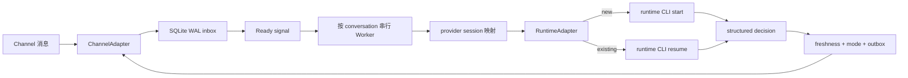

# agent-channel-host

`agent-channel-host` 是事件驱动的数字化员工会话宿主：它从 Channel adapter 接收已授权群聊/私聊消息，维护 conversation 与 Agent runtime session 的独立映射，再通过同一 Channel adapter 受控回复。

当前可运行组合是 DingTalk DWS + Codex CLI。DingTalk 不以 `@` 作为唯一入口；每条授权消息都会进入所属 conversation 的固定 Codex session，由 Agent 根据自己的工作目录、配置和独立历史决定 `silent / reply`。Host 不替 Agent 判断职责或编排任务。项目不运行 Codex App Server，也不提供第二套消息接收服务。

首版发布 Node.js/TypeScript npm package，命令名为 `agent-channel`，不提供 Windows portable zip/exe。

## 运行机制



- 一个 instance 只持有一个 Channel owner。当前 DingTalk adapter 用跨 instance 文件锁避免同一 DWS profile 被重复消费。
- 常驻的是 Host、DWS 长连接和 SQLite 状态，不是每个 conversation 的 provider 进程。消息到达后才启动一轮 runtime CLI；该轮完成后进程退出。
- 每个群聊/私聊持久化自己的 `(channel, profile, conversation) → runtime + provider session ID + generation`，彼此不共享 transcript。
- 新 Codex 会话执行 `codex exec --json --output-schema`；已有会话执行 `codex exec resume <原 ID>`。每次 resume 都校验 `thread.started.thread_id` 必须等于原 ID，否则 fail closed，不创建第二条 session。
- 普通 turn 只转发本批消息的“发送者、时间、内容”。引用和合并转发折叠进内容；Host 不附带群名、私聊标识、职责、成员资料、历史摘要或 checkpoint。
- Runtime 自己保存、resume 和压缩 transcript。Host 不安装 compaction hook，也不向 provider session 注入身份或恢复指令；Agent 的长期规则由 runtime 工作目录自行维护。
- 每条消息先写 SQLite WAL，提交后才发进程内 ready signal。Worker 不轮询 DWS 或 SQLite；Host 启动时一次性 reconciliation：释放中断的 claim、重新处理未完成及未达 3 次上限的失败消息，并用原 UUID 重试未确认的 outbox。已完成消息和已提交 outbox 不重放，达到上限的失败项保留终止状态。
- quiet window 默认 300 ms，一次最多合并 20 条消息。active turn 期间的新消息会终止旧 CLI 进程，释放旧 claim，再与新消息合并处理。
- Host 不配置 turn 超时，也不会因运行时长终止活动 turn。claim 由该 Conversation 的唯一 Worker 和 Host lease 持有，不按时间过期；只有新消息抢占、Host 停止或 runtime 自身退出会结束 turn，进程中断后的 claim 在下次 Host 启动时统一恢复。
- 群首次接入是持久工作：只读拉取最近 50 条消息，以同一最小信封交给该群固定 session。Agent 自主返回 `silent` 或 `reply`，不会被要求自我介绍；`shadow` 只保存 reply，切换 `reply` 并重启后用同一 UUID 发送。
- runtime 只返回 `{"action":"silent","replyText":""}` 或 `{"action":"reply","replyText":"..."}`。Host 只校验这个最小结构，再执行 conversation mode、freshness 和 outbox 门禁。

## 三段扩展边界

1. `ChannelAdapter` 负责连接、标准化入站、错误上报和发送。当前实现是 DingTalk DWS；新增 Slack、Teams 等 Channel 时不得自行管理 Agent session 或绕过 outbox。
2. `ConversationHost / EventDrivenScheduler` 负责 route binding、durable inbox、ready signal、lease/claim、合批、取消、Worker 生命周期和状态快照，不理解具体 Channel event key 或 runtime CLI 参数。
3. `RuntimeAdapter / AgentSession` 负责启动 runtime 自己的命令、创建/恢复 session、解析 structured decision、取消活动进程和暴露 session/process identity。当前实现是 Codex CLI；Claude Code、Gemini CLI、Qwen CLI 应各自实现这个契约，不复制 Host、Store 或 Channel。

配置也按这三类职责拆分：`channel`、`runtime`、`scheduling`。当前版本只注册 `dingtalk` 与 `codex`，未知 adapter 会明确失败。每个 Channel 内分别配置群聊/私聊的准入范围和新 Conversation 默认模式；这些策略不改变底层唯一 owner。

## 前置条件

- Node.js `>=22.13.0`。项目使用 Node 内置 `node:sqlite`，Node 22 可能显示 experimental warning。
- 已安装并登录 DWS；当前验证基线为 `dws v1.0.55`。
- 已安装并登录 Codex CLI；当前固定基线为 `codex-cli 0.145.0`。
- DWS/Codex 凭据由各自 CLI 管理；Host 配置与数据库不复制 token、cookie 或 client secret。

## 从源码安装

```powershell
git clone https://github.com/HiQ-AI/agent-channel-host.git
Set-Location .\agent-channel-host
npm ci
npm run verify
npm link
agent-channel --help
```

## 初始化

初始化只写本地配置和空 SQLite 数据库，不启动订阅或发送消息：

```powershell
agent-channel init `
  --instance triss `
  --cwd 'D:\agent-workspaces\triss' `
  --name '翠丝' `
  --role '公司数字化员工；按自身角色与各会话职责边界参与讨论'

agent-channel doctor --instance triss
```

默认 runtime 是 Codex CLI，模型为 `gpt-5.6-sol`，推理强度为 `low`。可在初始化时覆盖，或修改已有 instance 后重启 Host：

```powershell
agent-channel init `
  --instance triss-terra `
  --cwd 'D:\agent-workspaces\triss-terra' `
  --model gpt-5.6-terra `
  --effort medium

agent-channel config model `
  --instance triss `
  --model gpt-5.6-sol `
  --effort low
```

`doctor` 校验固定 Codex 版本，以及 `exec`/`resume` 的 JSONL、output schema 和显式 session ID 命令面。命令模式没有 App Server 的实时模型目录；模型名称或推理强度是否可用，由 `verify` 或首轮真实执行 fail closed 验证，不静默回退。

Windows 默认数据目录：

```text
%LOCALAPPDATA%\agent-channel-host\instances\triss\
├── config.yaml
├── state.sqlite3
├── run-host.cmd
└── service.log
```

也可用 `AGENT_CHANNEL_HOME` 指向其他用户级状态根。DWS owner lock 位于当前操作系统用户的公共运行目录，不随该变量改变。配置样例见 [`examples/triss-config.yaml`](examples/triss-config.yaml)。

### 从 0.2 App Server 预览版迁移

0.3 配置版本为 `version: 2`，删除 `protocol` 块，并把原来混在 `runtime` 中的 DWS、调度与 Codex 字段拆开。项目尚未正式部署，因此不保留两套加载路径；读取 `version: 1` 会明确失败。

旧预览 instance 应先停止 Host 并备份完整 SQLite/WAL 目录，然后按配置样例人工迁移。当前 SQLite schema 为 v8，新增 conversation session generation 与重置审计；旧 checkpoint/成员资料列仅作为本地管理数据保留，不再自动注入 runtime。迁移会丢弃尚未提交的旧 onboarding 自我介绍草稿，保留已提交状态，再由新 session 按最近消息重新判断。旧 App Server session 或旧消息协议与当前 command runtime 不兼容时，Host 会提升 generation、审计旧 provider session ID 并创建新 session，不会错误 resume 受污染 transcript。

## 添加授权会话

群聊按标题调用 DWS 搜索，并要求唯一精确匹配。省略 `--mode` 时使用 Channel 的“群聊默认模式”；新配置默认 `shadow`，即正常处理和留证但不发送。

```powershell
agent-channel conversation add `
  --instance triss `
  --kind group `
  --title '广场＆编辑器迭代中...' `
  --responsibility '回答编辑器相关问题、需求、方案和 bug 排查；不负责开发实现' `
  --mode shadow `
  --warm-seconds 30

agent-channel conversation list --instance triss
```

私聊使用 DWS 提供的 `openDingTalkId`，不按姓名猜测：

```powershell
agent-channel conversation add `
  --instance triss `
  --kind direct `
  --title '同事私聊' `
  --open-dingtalk-id '<openDingTalkId>' `
  --responsibility '按翠丝默认角色回答职责范围内问题' `
  --mode shadow
```

`--responsibility` 省略时使用 `identity.role`，但该字段只作为 Host 本地管理备注，不自动注入 runtime；Agent 的真实职责应配置在自己的 runtime 工作目录。`--mode` 省略时按 kind 使用“群聊默认模式”或“私聊默认模式”。`conversation disable/enable --id <UUID>` 控制指定会话；未准入 conversation 的事件只记录脱敏拒绝原因，不持久化正文。

### Channel 订阅范围

每个 Instance 的 Channel 可分别配置群聊和私聊：

- `none`：该类消息全部拒绝；
- `selected`：仅准入已登记且 enabled 的 Conversation；这是旧配置和新 Instance 的默认值；
- `all`：未知 Conversation 收到首条消息时自动以 Agent 默认职责、对应默认模式和当前 runtime 建档，再持久准入。显式 disabled 的 Conversation 仍然拒绝，不会被 `all` 绕过。

“群聊默认模式”和“私聊默认模式”分别取 `shadow/reply`，只影响之后自动建档或未显式指定 mode 的新 Conversation；已有 Conversation 的 mode 不会被批量改写。`reply` 表示 Host 允许 Agent 的 reply 决定进入发送门禁，不表示每条消息都必须回复。旧 version 2 配置缺少这两个字段时均按 `shadow` 加载。

配置位于 `config.yaml`：

```yaml
channel:
  id: dingtalk
  enabled: true
  profileId: default
  command: dws
  subscriptions:
    groups: selected
    directs: selected
  defaultModes:
    groups: shadow
    directs: shadow
```

`none/selected/all` 是唯一共享事件流上的 Host 准入策略，`shadow/reply` 是新 Conversation 的默认发言权限，两者互不替代。无论如何配置，DingTalk 仍然只有一个 Channel owner、一个 bus，以及共享的群聊/私聊 consumer；不会为每个群或私聊创建接收服务。交互式 `view` 可在 Instance 的 Channel 页面逐项选择。View-owned Host 会按新配置重启；attached Host 只保存配置并提示外部重启。

## 离线 runtime canary

登记 conversation 后，可以在不连接 DWS、不发送消息的情况下真实运行 Codex CLI。连续两次执行应分别显示 `startupMode=new` 与 `startupMode=resumed`，且 `providerSessionIdPrefix` 相同：

```powershell
agent-channel verify --instance triss --id '<conversation UUID>'
agent-channel verify --instance triss --id '<conversation UUID>'
```

## Worker 生命周期

群聊和私聊都保留固定逻辑 session，但 runtime 子进程只在实际 turn 中存在。默认 Worker 对象在 inbox 清空后保温 30 秒；保温期间 `view` 的 PID 通常为空，因为 Codex CLI 已退出。TTL 到期只释放宿主内对象，不删除 provider session ID 或 Codex rollout。

```powershell
agent-channel conversation worker `
  --instance triss `
  --id '<conversation UUID>' `
  --warm-seconds 120
```

`--warm-seconds 0` 表示处理完成后立即释放。新消息仍会创建 Worker，并对原 session ID 执行 resume。

## 长会话与上下文压缩

自然讨论过程由各 runtime 的固定 session 保存，并由 runtime 自己 resume 与自动压缩。Host 不猜测何时发生压缩，也不重复注入身份、职责或摘要；需要跨压缩长期保留的信息，应由 Agent 自己的工作目录、skill 或 runtime 原生机制维护。Host 中已有的成员与职责字段可供本地管理界面查询，但不会进入普通 turn。

每次消息 prompt 只有一组重复的“发送者、时间、内容”和固定的最小返回约定，不包含会话字段。这样新增 Claude Code、Gemini CLI、Qwen CLI adapter 时可以复用同一消息语义，而不继承 Codex 专用行为指令。

## 前台启动与管理视图

交互使用时，`view` 是所有已初始化 instance 上层的首选启动命令，不需要也不接受 `--instance`：

```powershell
agent-channel view
```

`view` 会从用户状态目录发现全部已初始化 instance。顶层固定为 `总览 | 全局设置`，不会把某个 instance 的配置误称为全局设置：

- `总览` 只展示 INSTANCES 索引、跨实例消息汇总和全局告警，不重复铺开具体 Channel、Conversation、Runtime 或最近消息。Instance 行保留 Host/owner、Channel/Conversation 数、pending 和 alert 数，便于先判断应下钻到哪里。`↑/↓` 选择，`Enter/→` 下钻，`Esc/←` 逐层返回；`Tab` 只切换顶层“总览 / 全局设置”。
- Instance 详情集中展示该实例的 Channel、Conversation、消息汇总与最近消息、Runtime 和告警，其中 `CONVERSATIONS` 固定在 `MESSAGES` 上方。Conversation 选择以稳定 ID 跟踪，标题更新或跨 Channel 排序刷新后下钻仍打开当前高亮项。进入 Channel 后，五项依次为 `enabled/disabled`、群聊订阅、群聊默认模式、私聊订阅、私聊默认模式；后续分区展示指定群聊和指定私聊。群聊末行“搜索并绑定指定群聊”支持输入关键词、选择候选并写入现有 conversation registry；外部群 ID 不在界面展示。
- 新绑定群组使用“群聊默认模式”，本地职责备注继承该 Instance 的 Agent 默认角色，runtime 使用 Instance 当前配置。首次启动会拉取最近消息交给 Agent 自主判断。绑定不创建第二套接收服务；Channel disabled 时可先配置群组，重新启用后继续复用原 registry 和 session 映射。
- 指定私聊继续使用稳定 `openDingTalkId` 登记，不按姓名猜测 ID；事件提供人员姓名时以姓名作为显示标题，确实拿不到时显示不泄露原始 ID 的稳定占位。通过 `conversation add --open-dingtalk-id` 添加后会出现在 Channel 的 DIRECTS 分区，并可下钻修改或删除。
- `INSTANCES` 表末行固定为“新增 Instance”，也可在总览按 `a` 启动受校验的创建向导。创建复用 `agent-channel init` 的同一原子初始化逻辑，并立即加入当前 View 的 Channel 页面。
- `全局设置` 只表示整个 View/Host 的作用域，绝不显示 Agent、Runtime、Channel 或 conversation 等 instance 配置。当前版本尚无已确认的全局可修改项，因此只展示真实管理状态并明确提示为空。

每个 Instance 设置页可修改 Agent 显示信息、Runtime cwd、runtime model/effort 和合批参数。Runtime cwd 保存前会解析为绝对路径并复用启动配置 schema 校验；View-owned Host 随配置重启，attached Host 提示外部重启。若已有 provider session 的 cwd 与新值不一致，Host 会提升 generation 后创建新 session。Conversation 详情按 `e` 或 `s` 后可修改本地显示名称、enabled、本地职责备注、mode、warm TTL 和已观察成员资料；这些资料不自动注入 runtime。`mode`、推理强度、订阅范围等固定枚举由 Enter 逐项选择，不进入文本编辑。Channel 开关、订阅范围、默认模式与绑定统一放在 Instance 下钻后的 Channel 页面。TUI 新建 Instance 时 DingTalk 默认 `disabled`，避免未确认 DWS profile 就抢占现有 owner。

### 删除 Instance 与 Conversation

删除都是二次确认操作：第一次按 `d` 只显示目标和影响，Enter 或再次按 `d` 执行，Esc/`←` 取消。

- 在总览或 Instance 详情删除 Instance：停止当前 View 启动的 Host，移除可能存在的同名 Windows 用户计划任务，关闭数据库，再精确删除该 Instance 的配置、SQLite/WAL、日志和本地 session 映射。
- 在 Channel 的 GROUPS/DIRECTS 选中会话，或在 Conversation 详情删除：停止目标 View-owned Host，级联删除消息、decision、outbox、runtime session/worker、旧 checkpoint、成员、首次群历史状态和 Worker lease；随后恢复该 Instance Host。两处都使用同一个二次确认和生命周期 action。
- attached Host 仍存活时两种删除都 fail closed。View 不会越权修改外部进程持有的内存态；先用原进程管理方式停止 Host，再重新进入 `view` 删除。
- 删除动作执行期间暂停周期刷新，避免读取已关闭的 Store；成功后由当前输入动作立即重绘，顶部计数、实例/会话列表、消息汇总、告警、选中项和确认状态无需等待下一次定时刷新。
- Windows 上计划任务不存在按原始字节识别本地代码页，不会因中文错误乱码阻断删除；权限错误或无法识别的查询失败仍然 fail closed。

Conversation 删除后不会用原 provider session 恢复；如果以后重新绑定同一个外部会话，它会作为新 Conversation 建立新逻辑 session。

字段设置、新增 Instance 向导和群搜索输入都支持单行光标编辑：`←/→` 移动，Home/End 跳到首尾，Backspace 删除光标前字符，Delete 删除光标后字符，Enter 提交，Esc 取消或返回。只有在非编辑态，`←/→` 才表示返回/下钻。

保存设置、搜索、新建和删除等可能触发配置校验、Host 重启或文件生命周期的操作，会在真正等待前立即切换到带 spinner 和已用时的“处理中”帧。处理期间输入锁定，同一 View 内的写操作仍串行；进度帧仅使用操作前的稳定快照，不读取删除期间可能已关闭的 SQLite Store。完成后自动刷新结果，失败则回到原页面并显示原始错误。

交互式终端会进入 alternate screen，以固定窗口刷新，不把历史帧留在主终端 scrollback；退出或收到 SIGINT/SIGTERM 时恢复原屏幕和光标。界面用少量语义颜色突出当前选中项、正常/等待/异常状态和告警。`INSTANCES`、Channel 与 Instance 设置表格使用清晰分隔并按终端显示宽度左对齐；中文、全角字符、常见 emoji 和组合字符不会再按 JavaScript 字符长度误算列宽。`view --once` 和非交互输出不进入 alternate screen，也始终不带 ANSI；需要在交互终端禁用颜色时设置 `NO_COLOR`：

```powershell
$env:NO_COLOR = '1'
agent-channel view
```

- 某个 instance 的 Host 未运行：`view` 在当前进程内为该 instance 启动唯一 Host；退出时只停止由本次 view 启动的 Host。
- 某个 instance 的 Host 已运行：`view` 只 attach 该 instance 状态，不创建第二个 Channel owner；退出不停止原有 Host。
- Channel 页面切换开关后：由当前 View 启动的 Host 只重启目标 Instance；attach 的外部 Host 不会被 View 越权停止，只提示用户重启该 Host。
- 尚无 instance：仍进入空总览，`INSTANCES` 表直接显示“新增 Instance”；按 `a` 或在该行按 `Enter` 创建，不要求退出执行外部命令。
- `--once`：聚合输出全部 instance 的一次脱敏快照，绝不启动 Host。
- 非交互式服务：继续使用单 instance 的 `agent-channel run --instance <name>`。

常用状态命令：

```powershell
agent-channel status --instance triss
agent-channel view --once
agent-channel run --instance triss
```

`status --instance` 输出一个 instance 的机器可读 JSON；`view` 是跨 instance 的交互管理面。非编辑态第一次按 `q` 或任何状态下按 `Ctrl+C` 只打开退出确认，并明确显示会停止多少个 View-owned Host；再次按 `q`、`Ctrl+C` 或 Enter 才退出，按 Esc/`←` 取消且保留当前页面与尚未提交的编辑内容。进程收到外部 SIGINT/SIGTERM 时仍立即安全收尾。总览和详情默认不显示正文、完整外部 conversation ID 或完整 provider session ID；本地排查时可显式加 `--show-content` 查看截断预览。instance 设置先通过与启动相同的 schema 校验，再原子保存；标记“重启后生效”的配置不会伪装成已即时应用。

先在 `shadow` 模式确认 `received/processed`、固定 provider session 前缀、重启 resume 和 Agent 判断，才切到发送模式：

```powershell
agent-channel conversation mode --instance triss --id '<conversation UUID>' --mode reply
```

Windows 当前用户常驻可使用计划任务，不以 LocalSystem 运行、不复制登录态：

```powershell
agent-channel service plan --instance triss
agent-channel service install --instance triss
agent-channel service remove --instance triss --check
agent-channel service remove --instance triss
```

## 可靠性与安全边界

- SQLite WAL 保证 Host 收到事件后的本地 admission/outbox 原子性。DWS v1.0.55 的本地 event bus 是易失 fan-out，不能宣称端到端 exactly-once。
- Host 启动恢复只重试未达 3 次上限的 failed inbox 与未确认 outbox；outbox 沿用原 UUID，并在实际发送前再次校验 Conversation 权限和最新消息 sequence。达到上限、已完成或已提交的记录不会自动重放。
- `submitted` 只表示 DWS 发送调用成功，不等于对端已读或业务已接受。
- Host 不启动第二个网络接收服务；当前数据面是一个 DWS owner 加群聊/私聊两个共享 bus consumer。
- Host 不覆盖 Codex 的 `approval_policy`、sandbox、network 或 writable roots；这些权限与 MCP/skills 一样由 runtime 自身配置加载。`runtime.cwd` 必须指向专用工作目录，部署者必须按该 runtime 的权限模型独立审计。
- Host 不安装 compaction hook，也不审查 Agent 的命令、文件或内部任务行为。
- Runtime 返回不符合 `{action, replyText}` 最小结构时，仅将对应 Conversation 的当前 batch 标为 failed 并禁止出站；不会停止唯一 Channel owner或阻断其他 Conversation。
- 决定、inbox 完成和可选 outbox 在同一事务内写入。Host 重启发现活动 claim 时会提升 session generation，避免把同一消息再次输入可能已包含该消息的旧 transcript。

## 开发与验收

```powershell
npm ci
npm test
npm run verify

$canaryRoot = 'D:\baibu-agent\scratchpad\agent-channel-host-command-canary'
node docs/acceptance/message-forwarding-proxy/scripts/codex-message-proxy-canary.mjs $canaryRoot
```

自动化测试覆盖最小消息信封、最小返回结构、首次群历史 `silent/reply`、SQLite admission/去重/sequence、原子 decision/outbox、Conversation 删除级联、Instance 精确删除、`none/selected/all` 准入与自动建档、无过期 claim/release/有界失败恢复、session generation 重置审计、原 UUID outbox 重试、跨 Channel 路由、固定 session resume、outbox freshness、lease、ready signal、quiet-window burst、无 turn 超时、active command cancel、warm TTL、DWS 参数、错误处理、稳定 Conversation 选择、详情分区顺序、Runtime cwd 原子保存、Channel 行删除、分层 `status/view`、删除确认、管理设置保存、service plan 和 CLI 实跑。

真实 Codex canary 只验证 runtime CLI 与固定 session 恢复，不连接或发送 DingTalk。真实 DWS 收发必须在专用测试群/账号获得单独授权后执行。
