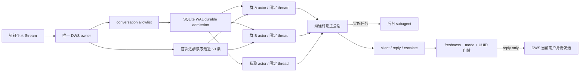

# dingtalk-codex-host

`dingtalk-codex-host` 把当前钉钉用户收到的授权群聊/私聊消息，持续送入每个会话各自独立的 Codex App Server thread。它不是一个必须 `@` 才启动的机器人：Host 会观察允许列表内的每条新消息，由固定会话判断 `silent / reply / escalate`，只有通过本地出站门禁的 `reply` 才会调用 DWS 发送。

首版只发布 Node.js/TypeScript npm package，命令名为 `dingtalk-codex`。不提供 Windows portable zip/exe。

## 运行机制



- 一个 instance 只持有一个 DWS bus owner；同一个 DWS profile 由跨 instance 文件锁防止重复 owner。
- 每个群/私聊保存自己的 conversation 记录、Codex App Server 子进程和完整 thread ID，彼此不共享 transcript。
- instance 可配置默认 Codex 模型和推理强度；未配置时使用 `gpt-5.6-sol + low`。每次启动 App Server 都先用 `model/list` 校验组合可用，再将模型用于 thread 创建/恢复和每轮 turn。
- 每个群聊/私聊独立配置 `resident` 或 `idle`。默认群聊常驻，私聊空闲 5 分钟释放 App Server 子进程；超时可按会话修改。释放不删除 thread，下一条消息仍以原 ID 精确 `thread/resume`。
- 群首次由 Host 启动时，先只读拉取最近 50 条消息并按时间顺序交给固定主 thread，再生成一次自我介绍。`shadow` 只准备并持久化介绍；切为 `reply`、重启 Host 后使用同一 UUID 发送，成功后不再重复介绍。
- 新消息先提交 SQLite WAL，再中断当前 active turn；等 `turn/completed.status=interrupted` 后，在同一个 thread 上为新消息启动独立 turn。实现不使用 `turn/steer`。
- 新 thread 先保存 `provisioning`，执行严格 silent bootstrap，检查 `thread/loaded/list` 后才标记 `ready`。重启只允许精确 `thread/resume` 原 ID；状态或协议不匹配时 fail closed，不自动新建第二条 thread。
- 固定主 thread 只负责理解讨论、澄清和回报进展。具体实施请求必须调用 Codex 原生 `spawn_agent` 派发后台 subagent，并立即返回接手回执；宿主只有观察到真实子 thread ID 且主 thread 没有直接执行命令或改文件时，才接受该决定。后台 worker 不占用 actor drain，群里的后续消息仍可进入主 thread。
- 模型最终文本不会直接发送。App Server 必须返回 output schema 约束的决定；只有 conversation 为 `reply`、action 为 `reply`、输入仍是该会话最新 sequence 时才写 outbox，并在调用 DWS 前再次检查 freshness。

## 前置条件

- Node.js `>=22.13.0`。本项目使用 Node 内置 `node:sqlite`；Node 22 会显示 SQLite experimental warning，这是 Node 当前的 API 状态。
- 已安装并登录 DWS，当前验证基线是 `dws v1.0.55`。
- 已安装并登录 Codex CLI，当前固定基线是 `codex-cli 0.145.0`，并校验该版本生成的 App Server JSON Schema SHA-256。
- DWS/Codex 凭据继续由各自工具管理，本项目的配置和数据库不复制 token、cookie 或 client secret。

## 从源码安装

仓库发布到 GitHub 后，可直接从源码构建并注册全局命令：

```powershell
git clone https://github.com/HiQ-AI/dingtalk-codex-host.git
Set-Location .\dingtalk-codex-host
npm ci
npm run verify
npm link
dingtalk-codex --help
```

## 初始化

下面只写本地 instance 配置和空 SQLite 数据库，不启动订阅，也不发送消息：

```powershell
dingtalk-codex init `
  --instance triss `
  --cwd 'D:\agent-workspaces\triss' `
  --name '翠丝' `
  --role '公司数字化员工；按自身角色与各会话职责边界参与讨论'

dingtalk-codex doctor --instance triss
```

默认模型是 `gpt-5.6-sol`，默认推理强度是 `low`。初始化时可覆盖，已有 instance 可单独修改；运行中的 Host 需重启后生效：

```powershell
dingtalk-codex init `
  --instance triss-terra `
  --cwd 'D:\agent-workspaces\triss-terra' `
  --model gpt-5.6-terra `
  --effort medium

dingtalk-codex config model `
  --instance triss `
  --model gpt-5.6-sol `
  --effort low
```

模型名称不使用静态白名单，以便 Codex 后续增加模型；推理强度接受 `low / medium / high / xhigh / max / ultra`。真正启动会话前，Host 读取当前 Codex App Server 的 `model/list`，模型不存在或不支持所选强度时直接失败，不会悄悄回退。

Windows 默认数据目录为：

```text
%LOCALAPPDATA%\dingtalk-codex-host\instances\triss\
├── config.yaml
├── state.sqlite3
├── protocol\
├── run-host.cmd
└── service.log
```

也可以用 `DINGTALK_CODEX_HOME` 指向另一个用户级状态根目录。DWS owner lock 始终位于当前操作系统用户的公共运行目录，不随该变量改变，避免两个 instance home 同时占用同一 profile。配置样例见 [`examples/triss-config.yaml`](examples/triss-config.yaml)，其中不包含 conversation ID 或凭据。

## 添加授权会话

群聊按标题调用 DWS 搜索，并要求唯一精确匹配；不会在多个候选中猜 ID。新会话默认 `shadow`，即正常处理和留证，但不发送：

```powershell
dingtalk-codex conversation add `
  --instance triss `
  --kind group `
  --title '广场＆编辑器迭代中...' `
  --responsibility '回答编辑器相关问题、需求、方案和 bug 排查；不负责开发实现' `
  --mode shadow

dingtalk-codex conversation list --instance triss
```

在连接 DWS 前，可对已登记会话执行离线 App Server canary。它会实际创建或恢复该会话的固定 Codex thread，并运行严格 silent turn，但不会订阅或发送钉钉消息；连续执行两次应分别看到 `startupMode=started` 和 `startupMode=resumed`，且 thread 前缀一致：

```powershell
dingtalk-codex verify --instance triss --id '<conversation UUID>'
dingtalk-codex verify --instance triss --id '<conversation UUID>'
```

私聊使用 DWS 提供的 `openDingTalkId`，不接受姓名猜测：

```powershell
dingtalk-codex conversation add `
  --instance triss `
  --kind direct `
  --title '同事私聊' `
  --open-dingtalk-id '<openDingTalkId>' `
  --responsibility '按翠丝默认角色回答职责范围内问题' `
  --mode shadow
```

`conversation disable/enable --id <UUID>` 控制 allowlist。未授权 conversation 的事件只记录脱敏拒绝计数，不持久化消息正文。
`--responsibility` 可省略；省略时使用 instance 的 `identity.role` 作为该会话职责。

## 会话生命周期

`conversation add` 的默认值是 `group=resident`、`direct=idle + 5 分钟`。也可以在添加时覆盖：

```powershell
dingtalk-codex conversation add `
  --instance triss `
  --kind group `
  --title '低频项目群' `
  --lifecycle idle `
  --idle-minutes 15
```

已有会话使用独立命令修改；运行中的 Host 需重启后生效：

```powershell
# 空闲 10 分钟后释放本地 App Server 进程
dingtalk-codex conversation lifecycle `
  --instance triss `
  --id '<conversation UUID>' `
  --lifecycle idle `
  --idle-minutes 10

# 改为常驻；已保存的空闲分钟数保留，供以后切回 idle
dingtalk-codex conversation lifecycle `
  --instance triss `
  --id '<conversation UUID>' `
  --lifecycle resident
```

空闲分钟数允许 `1-35791` 的整数，避免超过 Node.js 单次定时器上限。计时从该会话最近一条新消息重新开始；到期时若主 turn、排队消息或后台 subagent 仍在工作，Host 会等待真正空闲后再释放，不会为了回收资源中断正在实施的任务。`conversation list` 会显示每个会话的 `sessionLifecycle` 和 `idleTimeoutMinutes`。

## 前台验证与常驻

先在 `shadow` 模式前台运行，看到 `HOST_READY` 后再发一条不含 `@` 的测试消息：

```powershell
dingtalk-codex run --instance triss
```

另一个 PowerShell 查看脱敏状态：

```powershell
dingtalk-codex status --instance triss
```

`status` 的 `hostState` 来自 SQLite lease 心跳；`recoverable_sessions` 表示已完成 bootstrap、可精确 resume 的持久 session，不把它冒充为当前仍有子进程运行。

确认 `received/processed`、固定 `threadIdPrefix`、重启后的 resume 和职责判断后，才显式切到 `reply`；运行中的 Host 需重启后读取新 mode：

```powershell
dingtalk-codex conversation mode --instance triss --id '<conversation UUID>' --mode reply
```

群在 `shadow` 首次启动后，介绍已经准备但不会发送；上述切换后必须重启 Host，启动阶段会先发送这条已准备介绍，再开始消费实时事件。真实历史拉取与发送应只在专用测试群完成。

Windows 当前用户常驻使用计划任务，不以 LocalSystem 运行，也不复制登录态：

```powershell
dingtalk-codex service plan --instance triss
dingtalk-codex service install --instance triss
```

卸载前先做零副作用检查：

```powershell
dingtalk-codex service remove --instance triss --check
dingtalk-codex service remove --instance triss
```

非 Windows 平台可用 `dingtalk-codex run` 接入 systemd user、launchd 或平台进程管理器；首版不自动写这些平台的 service 文件。

## 可靠性与安全边界

- SQLite WAL 保证的是 Host 收到事件后的本地 admission/outbox 原子性。DWS v1.0.55 的本地 event bus 是易失 fan-out，早 ACK、进程内去重和断线窗口意味着这里不能宣称端到端 exactly-once。
- `submitted` 只表示 DWS 发送调用成功，不等于对端已读或业务已接受。
- Host 不会启动第二个网络接收服务；数据面就是当前用户下的一个 DWS owner 加两个共享 bus 的 consumer（全群、全单聊）。
- conversation 内容属于本地敏感数据。状态命令和运行日志不输出正文、完整 conversation ID 或完整 thread ID；请按用户级敏感目录保护 instance 数据。
- `idle` 只关闭本机 App Server 进程，SQLite 中的原 thread ID 和 Codex rollout 仍会保留；清理这些持久数据属于另一项显式操作。
- App Server 的主 thread 与 subagent 使用 `workspaceWrite`，可写范围固定为 instance 配置的 `runtime.cwd`，网络关闭且审批策略为 `never`。请把 `runtime.cwd` 指向专用工作目录；主 thread 直接执行 `commandExecution` 或 `fileChange` 时，本轮 fail closed、不发群回执。
- 修改默认模型会作用于新 thread、恢复的旧 thread 和后续每个 turn。恢复既有 thread 时如果模型不同，Codex 会按 App Server 契约记录一次模型切换提示；Host 不会因此另建 thread。
- App Server 使用 stdio，不开放 experimental WebSocket transport；升级 Codex 前必须更新固定版本和生成 schema SHA，并重新执行测试、doctor、thread resume canary。

## 开发与验收

```powershell
npm ci
npm test
npm run verify

$canaryRoot = Join-Path $env:LOCALAPPDATA 'dingtalk-codex-host\delegation-canary'
node docs/acceptance/group-onboarding-delegation/scripts/app-server-delegation-canary.mjs $canaryRoot

$resumeRoot = Join-Path $env:LOCALAPPDATA 'dingtalk-codex-host\resume-canary'
node docs/acceptance/conversation-lifecycle/scripts/app-server-resume-canary.mjs $resumeRoot

$modelRoot = Join-Path $env:LOCALAPPDATA 'dingtalk-codex-host\model-canary'
node docs/acceptance/default-codex-model/scripts/default-model-canary.mjs $modelRoot
```

测试覆盖 SQLite admission/去重/sequence、outbox 双重 freshness、单 owner lease、默认模型旧配置兼容与修改命令、模型目录 fail closed、每会话生命周期默认值与迁移、空闲计时/忙碌保护、首次群历史与介绍状态机、DWS 参数契约、active turn 中断、固定 session 上的新 turn、后台 subagent 决策证据、用户级 service 计划和 CLI init/status。委派 canary 会真实派发一个延迟 worker；生命周期 canary 会实际执行 start → stop → resume 并核对 thread ID；默认模型 canary 会用全新 instance 实跑 `gpt-5.6-sol + low` 的 start/resume/turn，但都不连接或发送钉钉。真实 DWS 收发必须使用专用测试群/账号单独授权执行；`verify` 用于本机固定会话 App Server canary。
