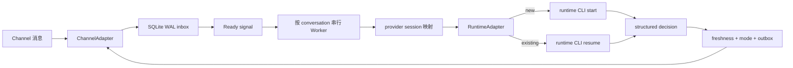

# agent-channel-host

`agent-channel-host` 是事件驱动的数字化员工会话宿主：它从 Channel adapter 接收已授权群聊/私聊消息，维护 conversation 与 Agent runtime session 的独立映射，再通过同一 Channel adapter 受控回复。

当前可运行组合是 DingTalk DWS + Codex CLI。DingTalk 不以 `@` 作为唯一入口；每条授权消息都会进入所属 conversation 的固定 Codex session，由模型结合独立历史和职责边界判断 `silent / reply / escalate`。项目不运行 Codex App Server，也不提供第二套消息接收服务。

首版发布 Node.js/TypeScript npm package，命令名为 `agent-channel`，不提供 Windows portable zip/exe。

## 运行机制



- 一个 instance 只持有一个 Channel owner。当前 DingTalk adapter 用跨 instance 文件锁避免同一 DWS profile 被重复消费。
- 常驻的是 Host、DWS 长连接和 SQLite 状态，不是每个 conversation 的 provider 进程。消息到达后才启动一轮 runtime CLI；该轮完成后进程退出。
- 每个群聊/私聊持久化自己的 `(channel, profile, conversation) → runtime + provider session ID + generation`，彼此不共享 transcript。
- 新 Codex 会话执行 `codex exec --json --output-schema`；已有会话执行 `codex exec resume <原 ID>`。每次 resume 都校验 `thread.started.thread_id` 必须等于原 ID，否则 fail closed，不创建第二条 session。
- 正常 turn 依赖 runtime 自己的 transcript，不重复注入整段历史。Host 只维护短小、版本化的 conversation checkpoint；Codex 自动压缩后由本包内置的 `SessionStart(source=compact)` hook 在下一次模型请求前恢复必要状态。
- 群成员、组织角色、会话角色和职责边界保存在独立成员资料中。每批只提供本批发送者与正文明确提到的已知成员，不把完整群成员表长期塞入 session。
- 每条消息先写 SQLite WAL，提交后才发进程内 ready signal。Worker 不轮询 DWS 或 SQLite；Host 重启时只 reconciliation 未完成工作。
- quiet window 默认 300 ms，一次最多合并 20 条消息；每条消息仍保留 sender、时间和 sequence。active turn 期间的新消息会终止旧 CLI 进程，释放旧 claim，再与新消息合并处理。
- 群首次 onboarding 是持久工作：只读拉取最近 50 条消息进入该群独立 session，再准备一次自我介绍。`shadow` 只保存不发送；切换 `reply` 并重启后用同一 UUID 发送。
- 模型文本不会直接发送。runtime 必须返回 JSON Schema 约束的决定，宿主再执行字段、职责、签名、委派证据、conversation mode 和双重 freshness 门禁。

## 三段扩展边界

1. `ChannelAdapter` 负责连接、标准化入站、错误上报和发送。当前实现是 DingTalk DWS；新增 Slack、Teams 等 Channel 时不得自行管理 Agent session 或绕过 outbox。
2. `ConversationHost / EventDrivenScheduler` 负责 route binding、durable inbox、ready signal、lease/claim、合批、取消、Worker 生命周期和状态快照，不理解具体 Channel event key 或 runtime CLI 参数。
3. `RuntimeAdapter / AgentSession` 负责启动 runtime 自己的命令、创建/恢复 session、解析 structured decision、取消活动进程和暴露 session/process identity。当前实现是 Codex CLI；Claude Code、Gemini CLI、Qwen CLI 应各自实现这个契约，不复制 Host、Store 或 Channel。

配置也按这三类职责拆分：`channel`、`runtime`、`scheduling`。当前版本只注册 `dingtalk` 与 `codex`，未知 adapter 会明确失败。

## 前置条件

- Node.js `>=22.13.0`。项目使用 Node 内置 `node:sqlite`，Node 22 可能显示 experimental warning。
- 已安装并登录 DWS；当前验证基线为 `dws v1.0.55`。
- 已安装并登录 Codex CLI；当前固定基线为 `codex-cli 0.145.0`。
- DWS/Codex 凭据由各自 CLI 管理；Host 配置与数据库不复制 token、cookie 或 client secret。

## 从源码安装

```powershell
git clone https://github.com/HiQ-AI/agent-channel-host.git
Set-Location .\agent-channel-host
npm ci
npm run verify
npm link
agent-channel --help
```

## 初始化

初始化只写本地配置和空 SQLite 数据库，不启动订阅或发送消息：

```powershell
agent-channel init `
  --instance triss `
  --cwd 'D:\agent-workspaces\triss' `
  --name '翠丝' `
  --role '公司数字化员工；按自身角色与各会话职责边界参与讨论'

agent-channel doctor --instance triss
```

默认 runtime 是 Codex CLI，模型为 `gpt-5.6-sol`，推理强度为 `low`。可在初始化时覆盖，或修改已有 instance 后重启 Host：

```powershell
agent-channel init `
  --instance triss-terra `
  --cwd 'D:\agent-workspaces\triss-terra' `
  --model gpt-5.6-terra `
  --effort medium

agent-channel config model `
  --instance triss `
  --model gpt-5.6-sol `
  --effort low
```

`doctor` 校验固定 Codex 版本，以及 `exec`/`resume` 的 JSONL、output schema 和显式 session ID 命令面。命令模式没有 App Server 的实时模型目录；模型名称或推理强度是否可用，由 `verify` 或首轮真实执行 fail closed 验证，不静默回退。

Windows 默认数据目录：

```text
%LOCALAPPDATA%\agent-channel-host\instances\triss\
├── config.yaml
├── state.sqlite3
├── recovery\
│   └── <conversation UUID>.json
├── run-host.cmd
└── service.log
```

也可用 `AGENT_CHANNEL_HOME` 指向其他用户级状态根。DWS owner lock 位于当前操作系统用户的公共运行目录，不随该变量改变。配置样例见 [`examples/triss-config.yaml`](examples/triss-config.yaml)。

### 从 0.2 App Server 预览版迁移

0.3 配置版本为 `version: 2`，删除 `protocol` 块，并把原来混在 `runtime` 中的 DWS、调度与 Codex 字段拆开。项目尚未正式部署，因此不保留两套加载路径；读取 `version: 1` 会明确失败。

旧预览 instance 应先停止 Host 并备份完整 SQLite/WAL 目录，然后按配置样例人工迁移。当前 SQLite schema 为 v5，旧表会原地增加 checkpoint、成员资料、policy version 和 runtime recovery capability；旧 App Server session 的协议指纹与 command runtime 不兼容，请为测试 conversation 使用新 instance 或显式清理对应预览状态，Host 不会偷偷创建第二个 provider session。

## 添加授权会话

群聊按标题调用 DWS 搜索，并要求唯一精确匹配。新会话默认 `shadow`：正常处理和留证，但不发送。

```powershell
agent-channel conversation add `
  --instance triss `
  --kind group `
  --title '广场＆编辑器迭代中...' `
  --responsibility '回答编辑器相关问题、需求、方案和 bug 排查；不负责开发实现' `
  --mode shadow `
  --warm-seconds 30

agent-channel conversation list --instance triss
```

私聊使用 DWS 提供的 `openDingTalkId`，不按姓名猜测：

```powershell
agent-channel conversation add `
  --instance triss `
  --kind direct `
  --title '同事私聊' `
  --open-dingtalk-id '<openDingTalkId>' `
  --responsibility '按翠丝默认角色回答职责范围内问题' `
  --mode shadow
```

`--responsibility` 省略时使用 `identity.role`。`conversation disable/enable --id <UUID>` 控制 allowlist；未授权 conversation 的事件只记录脱敏拒绝计数，不持久化正文。

## 离线 runtime canary

登记 conversation 后，可以在不连接 DWS、不发送消息的情况下真实运行 Codex CLI。连续两次执行应分别显示 `startupMode=new` 与 `startupMode=resumed`，且 `providerSessionIdPrefix` 相同：

```powershell
agent-channel verify --instance triss --id '<conversation UUID>'
agent-channel verify --instance triss --id '<conversation UUID>'
```

## Worker 生命周期

群聊和私聊都保留固定逻辑 session，但 runtime 子进程只在实际 turn 中存在。默认 Worker 对象在 inbox 清空后保温 30 秒；保温期间 `view` 的 PID 通常为空，因为 Codex CLI 已退出。TTL 到期只释放宿主内对象，不删除 provider session ID 或 Codex rollout。

```powershell
agent-channel conversation worker `
  --instance triss `
  --id '<conversation UUID>' `
  --warm-seconds 120
```

`--warm-seconds 0` 表示处理完成后立即释放。新消息仍会创建 Worker，并对原 session ID 执行 resume。

## 长会话与上下文压缩

Host 把自然讨论过程和必要工作状态分开管理：

- Runtime transcript 保存对话过程，由各 runtime 自己 resume 和压缩。
- Conversation checkpoint 只保存当前主题、仍有效事实、决定、承诺和未决问题，并记录覆盖到的入站 sequence。
- Runtime 没有长期状态变化时返回 `contextUpdate: null`；有变化时返回完整的当前 checkpoint。Host 将它和本轮决定放在同一 SQLite 事务中提交。
- Codex 每轮开始前原子发布最新 recovery 文件。新 session 会恢复已有 checkpoint；普通 resume 不重复注入；发生自动 compaction 时，内置 hook 才重新注入。
- 成员资料独立版本化，观察到的新名称自动更新；角色和职责边界可在 `view` 的设置 tab 修改，并按当前消息相关性提供给 runtime。

Prompt 固定采用“身份、会话职责、决策规则、权限边界、当前输入、输出要求”的顺序。指令使用明确动作，不使用“尽量、酌情、视情况”等模糊表述。

## 前台启动与管理视图

交互使用时，`view` 是所有已初始化 instance 上层的首选启动命令，不需要也不接受 `--instance`：

```powershell
agent-channel view
```

`view` 会从用户状态目录发现全部已初始化 instance。默认先进入聚合 instance、Channel、conversation、runtime 和消息状态的“总览”tab，而不是某个 instance 或单群页面。上下键选择 instance，`Enter` 先进入实例详情，再选择 conversation 下钻；`Esc` 逐层返回。`Tab` 或左右键切到相邻的“设置”tab，使用 `[` / `]` 选择目标 instance，再修改 Agent 身份、runtime model/effort、合批参数、当前会话职责/mode/warm TTL，以及已观察成员的角色和职责边界。

交互式终端会用少量语义颜色突出当前选中项、正常/等待/异常状态和告警；表格宽度仍按纯文本计算，不影响列对齐。设置 tab 的 `SETTING │ VALUE │ EFFECT` 三列使用竖线分隔并统一左对齐。`view --once` 和非交互输出始终不带 ANSI；需要在交互终端禁用颜色时设置 `NO_COLOR`：

```powershell
$env:NO_COLOR = '1'
agent-channel view
```

- 某个 instance 的 Host 未运行：`view` 在当前进程内为该 instance 启动唯一 Host；退出时只停止由本次 view 启动的 Host。
- 某个 instance 的 Host 已运行：`view` 只 attach 该 instance 状态，不创建第二个 Channel owner；退出不停止原有 Host。
- 尚无 instance：仍进入空总览并显示 `init` 引导，不报“缺少 instance”。
- `--once`：聚合输出全部 instance 的一次脱敏快照，绝不启动 Host。
- 非交互式服务：继续使用单 instance 的 `agent-channel run --instance <name>`。

常用状态命令：

```powershell
agent-channel status --instance triss
agent-channel view --once
agent-channel run --instance triss
```

`status --instance` 输出一个 instance 的机器可读 JSON；`view` 是跨 instance 的交互管理面，用 `q` 或 `Ctrl+C` 退出。总览和详情默认不显示正文、完整外部 conversation ID 或完整 provider session ID；本地排查时可显式加 `--show-content` 查看截断预览。设置先通过与启动相同的 schema 校验，再原子保存；标记“重启后生效”的配置不会伪装成已即时应用。

先在 `shadow` 模式确认 `received/processed`、固定 provider session 前缀、重启 resume 和职责判断，才切到发送模式：

```powershell
agent-channel conversation mode --instance triss --id '<conversation UUID>' --mode reply
```

Windows 当前用户常驻可使用计划任务，不以 LocalSystem 运行、不复制登录态：

```powershell
agent-channel service plan --instance triss
agent-channel service install --instance triss
agent-channel service remove --instance triss --check
agent-channel service remove --instance triss
```

## 可靠性与安全边界

- SQLite WAL 保证 Host 收到事件后的本地 admission/outbox 原子性。DWS v1.0.55 的本地 event bus 是易失 fan-out，不能宣称端到端 exactly-once。
- `submitted` 只表示 DWS 发送调用成功，不等于对端已读或业务已接受。
- Host 不启动第二个网络接收服务；当前数据面是一个 DWS owner 加群聊/私聊两个共享 bus consumer。
- Codex 每轮固定 `approval_policy=never`、`sandbox_mode=workspace-write`、network disabled，额外 writable roots 为空；`runtime.cwd` 必须指向专用工作目录。
- Codex compaction hook 由 Host 为每个子进程内联配置，命令和恢复文件均由本包控制。自动化使用固定版本已审查的 hook 配置，不修改用户级 Codex 配置。
- 主 session 的命令执行或文件修改一旦出现在 JSONL 证据中，本轮 fail closed，不发送回复。该门禁不替代操作系统账号隔离。
- 用户配置中的外部 MCP/skills 仍由 Codex CLI 自身加载；部署者必须按其权限模型审计。Host 的 prompt 禁止 runtime 自行调用 Channel 发送工具。
- 命令模式可观察 provider session 与当前 CLI PID，但不承诺后台 subagent 能在父 CLI 退出后继续运行；这项能力由具体 runtime adapter 决定。

## 开发与验收

```powershell
npm ci
npm test
npm run verify

$canaryRoot = 'D:\baibu-agent\scratchpad\agent-channel-host-command-canary'
node docs/acceptance/command-driven-runtime/scripts/codex-command-resume-canary.mjs $canaryRoot
```

自动化测试覆盖 SQLite admission/去重/sequence、checkpoint 与成员资料、claim/release/reconciliation、跨 Channel 路由、runtime session 迁移、compaction recovery、outbox freshness、lease、ready signal、quiet-window burst、active command cancel、warm TTL、群 onboarding、DWS 参数、结构化决定、命令新建/resume、错误/超时、`status/view` 脱敏、管理 tab 与设置保存、service plan 和 CLI 实跑。

真实 Codex canary 只验证 runtime CLI 与固定 session 恢复，不连接或发送 DingTalk。真实 DWS 收发必须在专用测试群/账号获得单独授权后执行。
