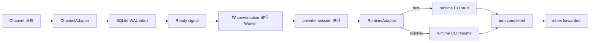

# agent-channel-host

`agent-channel-host` 是事件驱动的单向消息投递宿主：它从 Channel adapter 接收已授权群聊/私聊消息，维护 conversation 与 Agent runtime session 的独立映射，并确保每条消息成功进入对应 runtime session。

当前可运行组合是 DingTalk DWS + Codex App Server。DingTalk 不以 `@` 作为唯一入口；每条授权消息都会进入所属 conversation 的固定 Codex session，活动 turn 中的新消息通过 `turn/steer` 立即引导同一 turn。每个消息批次会携带一次 Channel 消息来源（渠道、群聊/私聊类型、可直接回复的外部目标 ID 和名称），不暴露 Host 内部 Conversation UUID。Host 不接收 Agent 的处理结果，不判断是否回复，也不代发回复；Agent 根据自己的工作目录、配置、工具和独立历史，自行决定是否处理、怎么处理、是否回复以及怎么回复。项目不提供第二套消息接收服务。

项目以公开 Node.js/TypeScript npm package `@zzusp/agent-channel-host` 发布，命令名为 `agent-channel`，不提供 Windows portable zip/exe。

面向安装、接入和日常运维的完整步骤见 [agent-channel-host 使用指南](https://github.com/HiQ-AI/agent-channel-host/blob/main/docs/manual/agent-channel-host-guide.md)。

## 运行机制



- 一个 instance 只持有一个 Channel owner。当前 DingTalk adapter 用跨 instance 文件锁避免同一 DWS profile 被重复消费。
- 常驻的是 Host、DWS 长连接和 SQLite 状态，不是每个 conversation 的 provider 进程。消息到达后才启动一轮 runtime CLI；该轮完成后进程退出。
- 每个群聊/私聊持久化自己的 `(channel, profile, conversation) → runtime + provider session ID + generation`，彼此不共享 transcript。
- 新 Codex 会话执行 `thread/start`，已有会话执行 `thread/resume` 并校验必须精确恢复原 ID，否则 fail closed，不创建第二条 session。Host 不配置 output schema，也不解析 Agent final text。
- Codex App Server 是纯后台 Runtime：新建和恢复 thread 都显式固定 `approvalPolicy=never`、`sandbox=danger-full-access`，不提供本地审批入口。若 Runtime 仍发出 command/file/permissions/MCP elicitation/requestUserInput 等交互请求，Host 立即终止该 Worker turn并保留消息供恢复，绝不等待人工输入或让 claim 永久悬挂。
- 每个 turn 在批次头只附带一次 `渠道 / 类型 / 目标ID / 群名称或对方名称`，其中目标 ID 是 Runtime 可直接回复的 Channel 外部地址，不是 Host 内部 Conversation UUID；钉钉群消息还携带每条消息的发送者 `openDingTalkId` 和结构化 @ 规则，Agent 需要同时使用正文 `<@openDingTalkId>` 占位符与 DWS `--at-open-dingtalk-ids` 参数，不能只输出 `@姓名` 纯文字。引用和合并转发折叠进内容。Host 不附带成员资料、历史摘要或 checkpoint。Conversation 配置了职责时，仅按下述周期在消息来源前增加一份短提醒。
- Runtime 自己保存、resume 和压缩 transcript。Host 不安装 compaction hook，也不覆盖 provider 的 developer/system 指令；Agent 的长期规则由 runtime 工作目录自行维护。
- 每条消息先写 SQLite WAL，提交后才发进程内 ready signal；静默窗口内已到达的消息按 `maxBatchMessages` 合成一次 runtime 输入。Host 启动时释放中断的 claim，并重新投递未转发及未达 3 次上限的失败消息。Runtime `turn.completed` 只转换为 inbox `forwarded` 凭据，不产生 Host `completed/processed/decision`；它不代表 Agent 已逐条处理、已回复或业务已完成。
- DWS 订阅若收到严格匹配“处理中/进行中/生成中/思考中”的短机器人占位消息，Channel 会用同一 `messageId` 在最多 15 秒内有界回查；非占位正文连续两次相同后才进入 inbox。普通消息不回查、不增加延迟；查询失败或到期时使用最后取得的正文，始终不丢弃原事件。
- quiet window 用于合并短时间内连续到达的消息。活动 turn 开始后才到达的新消息在 `turn/started` 确认后通过 `turn/steer` 追加到同一 turn，不打断、不排队到下一 turn，也不并发 resume 同一 session；steer 失败时 Worker fail closed，重启恢复后重试，绝不静默改投下一 turn。
- Host 不配置 turn 超时，也不会因运行时长或新消息终止活动 turn。Host 停止或 runtime 自身退出造成的未完成 claim 在下次启动时恢复。
- Host 启动时先建立群聊/私聊实时 consumer，再以每个已启用 Conversation 的最后消息时间为起点补拉至 consumer ready 时刻；没有本地消息时从 Conversation 创建时间开始。补拉起点向前重叠 2 秒，历史与实时交叠消息按同一 Conversation 的消息 ID 或 fingerprint 去重。补拉完成前不启动 Worker，任一会话补拉失败则 Host fail closed，不伪装 ready。
- 群首次接入时只读拉取最近 50 条消息，先逐条写入 history inbox，再按时间顺序合成一个首次引导交给该群固定 session。Host 不要求自我介绍、不接收决定，也不发送回复。

## 三段扩展边界

1. `ChannelAdapter` 负责连接、标准化入站和错误上报。当前实现是 DingTalk DWS；新增 Slack、Teams 等 Channel 时不得自行管理 Agent session。
2. `ConversationHost / EventDrivenScheduler` 负责 route binding、durable inbox、ready signal、lease/claim、同会话顺序合批投递、Worker 生命周期和状态快照。
3. `RuntimeAdapter / AgentSession` 负责启动 runtime、创建/恢复 session、开始 turn、引导活动 turn 并返回完成回执，以及暴露 session/process identity。当前实现是 Codex App Server；其他 runtime 必须提供等价 steer/interactive 能力，不能静默退化为排队。

配置也按这三类职责拆分：`channel`、`runtime`、`scheduling`。当前版本只注册 `dingtalk` 与 `codex`，未知 adapter 会明确失败。每个 Channel 内分别配置群聊/私聊的准入范围和新 Conversation 默认模式；这些策略不改变底层唯一 owner。

## 前置条件

- Node.js `>=22.13.0`。项目使用 Node 内置 `node:sqlite`，Node 22 可能显示 experimental warning。
- 已安装并登录 DWS；最低版本为 `dws v1.0.55`，允许使用更高版本。
- 已安装并登录 Codex CLI；最低版本为 `codex-cli 0.145.0`，允许使用更高版本。
- DWS/Codex 凭据由各自 CLI 管理；Host 配置与数据库不复制 token、cookie 或 client secret。

## 从 npm 安装

```powershell
npm install --global @zzusp/agent-channel-host
agent-channel --help
```

后续更新到 npm registry 最新版本：

```powershell
agent-channel update
```

命令会执行全局 npm 更新并回读安装后的版本；不会自动重启已经运行的独立 Host 或计划任务。版本变化见 [`CHANGELOG.md`](CHANGELOG.md)。

## 从源码安装

```powershell
git clone https://github.com/HiQ-AI/agent-channel-host.git
Set-Location .\agent-channel-host
npm ci
npm run verify
npm link
agent-channel --help
```

### 更新已有的源码安装

先退出正在运行的 `agent-channel view`。如果目标 Instance 由 Windows 用户计划任务常驻，先用旧版本命令移除该任务：

```powershell
$instanceName = 'triss'
agent-channel service remove --instance $instanceName
```

仓库已存在时，从最新 `main` 重新构建，并显式替换可能仍指向旧检出目录的全局 npm 链接：

```powershell
Set-Location 'D:\baibu-agent\agent-channel-host'
git fetch origin
git switch main
git pull --ff-only origin main
npm ci
npm run verify

npm unlink --global @zzusp/agent-channel-host
npm link

agent-channel --version
(Get-Item "$(npm root --global)\@zzusp\agent-channel-host").Target
```

版本应与仓库 `package.json` 一致，链接目标应为当前仓库目录。`npm unlink/link` 只替换命令安装链接，不删除 `%LOCALAPPDATA%\agent-channel-host` 下的 Instance 配置、SQLite 或 runtime session 映射。

交互式使用重新执行 `agent-channel view`；需要计划任务常驻时重新安装目标 Instance：

```powershell
agent-channel service install --instance $instanceName
agent-channel status --instance $instanceName
```

## 初始化

初始化只写本地配置和空 SQLite 数据库，不启动订阅或发送消息：

```powershell
agent-channel init `
  --instance triss `
  --cwd 'D:\agent-workspaces\triss' `
  --name '翠丝'

agent-channel doctor --instance triss
```

默认 runtime 是 Codex CLI，模型为 `gpt-5.6-sol`，推理强度为 `low`。可在初始化时覆盖，或修改已有 instance 后重启 Host：

```powershell
agent-channel init `
  --instance triss-terra `
  --cwd 'D:\agent-workspaces\triss-terra' `
  --model gpt-5.6-terra `
  --effort medium

agent-channel config model `
  --instance triss `
  --model gpt-5.6-sol `
  --effort low
```

`doctor` 校验固定 Codex 版本与 App Server stdio 控制面。模型名称、推理强度、thread resume 和 steer 由 `verify` 或首轮真实执行 fail closed 验证，不静默回退。

Windows 默认数据目录：

```text
%LOCALAPPDATA%\agent-channel-host\instances\triss\
├── config.yaml
├── state.sqlite3
├── run-host.cmd
└── service.log
```

也可用 `AGENT_CHANNEL_HOME` 指向其他用户级状态根。DWS owner lock 位于当前操作系统用户的公共运行目录，不随该变量改变。配置样例见 [`examples/triss-config.yaml`](examples/triss-config.yaml)。

### 从 0.2 App Server 预览版迁移

0.3 配置版本为 `version: 2`，删除 `protocol` 块，并把原来混在 `runtime` 中的 DWS、调度与 Codex 字段拆开。项目尚未正式部署，因此不保留两套加载路径；读取 `version: 1` 会明确失败。

旧预览 instance 应先停止 Host 并备份完整 SQLite/WAL 目录，然后按配置样例人工迁移。当前 SQLite schema 为 v9，保留 conversation session generation、历史重置审计和 `delivery_unknown` 发送终态；旧 checkpoint/成员资料列仅作为本地管理数据保留，不再自动注入 runtime。已有 Conversation 一律恢复其原 provider session；版本、协议、Runtime 配置或 cwd 变化不会自动轮换 session，恢复失败会明确报错并保留原映射。

## 添加授权会话

群聊按标题调用 DWS 搜索，并要求唯一精确匹配。省略 `--mode` 时使用 Channel 的“群聊默认模式”；新配置默认 `shadow`，即正常处理和留证但不发送。

```powershell
agent-channel conversation add `
  --instance triss `
  --kind group `
  --title '广场＆编辑器迭代中...' `
  --responsibility '回答编辑器相关问题、需求、方案和 bug 排查；不负责开发实现' `
  --mode shadow `
  --warm-seconds 300

agent-channel conversation list --instance triss
```

私聊使用 DWS 提供的 `openDingTalkId`，不按姓名猜测：

```powershell
agent-channel conversation add `
  --instance triss `
  --kind direct `
  --title '同事私聊' `
  --open-dingtalk-id '<openDingTalkId>' `
  --responsibility '按翠丝默认角色回答职责范围内问题' `
  --mode shadow
```

`--responsibility` 省略时保存为空，表示使用 Agent 在 runtime 工作目录中的自身职责；非空值按“长会话与上下文压缩”一节的周期提醒传给该 Conversation 的固定 session。`--mode` 省略时按 kind 使用“群聊默认模式”或“私聊默认模式”。`conversation disable/enable --id <UUID>` 控制指定会话；未准入 conversation 的事件只记录脱敏拒绝原因，不持久化正文。

### Channel 订阅范围

每个 Instance 的 Channel 可分别配置群聊和私聊：

- `none`：该类消息全部拒绝；
- `selected`：仅准入已登记且 enabled 的 Conversation；这是旧配置和新 Instance 的默认值；
- `all`：未知 Conversation 收到首条消息时以空职责、对应默认模式和当前 runtime 建档，再持久准入；空职责使用 Agent 自身职责。显式 disabled 的 Conversation 仍然拒绝，不会被 `all` 绕过。

“群聊默认模式”和“私聊默认模式”分别取 `shadow/reply`，只影响之后自动建档或未显式指定 mode 的新 Conversation；已有 Conversation 的 mode 不会被批量改写。`reply` 表示 Host 允许 Agent 的 reply 决定进入发送门禁，不表示每条消息都必须回复。旧 version 2 配置缺少这两个字段时均按 `shadow` 加载。

配置位于 `config.yaml`：

```yaml
channel:
  id: dingtalk
  enabled: true
  profileId: default
  command: dws
  subscriptions:
    groups: selected
    directs: selected
  defaultModes:
    groups: shadow
    directs: shadow
```

`none/selected/all` 是唯一共享事件流上的 Host 准入策略，`shadow/reply` 是新 Conversation 的默认发言权限，两者互不替代。DingTalk 始终只有一个 Channel owner 和一个 bus；群聊或私聊配置为 `none` 时不启动该类共享 consumer，两类都为 `none` 时 Channel 保持空闲且不启动 DWS 事件流。不会为每个群或私聊创建接收服务。交互式 `view` 可在 Instance 的 Channel 页面逐项选择，并管理全部 Instance Host 的重启。

## 离线 runtime canary

登记 conversation 后，可以在不连接 DWS、不发送消息的情况下真实运行 Codex CLI。连续两次执行应分别显示 `startupMode=new` 与 `startupMode=resumed`，且 `providerSessionIdPrefix` 相同：

```powershell
agent-channel verify --instance triss --id '<conversation UUID>'
agent-channel verify --instance triss --id '<conversation UUID>'
```

## Worker 生命周期

群聊和私聊都保留固定逻辑 session；Worker 活跃或保温期间 App Server 进程持续存在，以便新消息立即 steer。默认 Worker 在 inbox 清空后保温 5 分钟（300 秒），TTL 到期关闭 App Server 进程但不删除 provider session ID 或 Codex rollout。

```powershell
agent-channel conversation worker `
  --instance triss `
  --id '<conversation UUID>' `
  --warm-seconds 120
```

`--warm-seconds 0` 表示处理完成后立即释放。新消息仍会创建 Worker，并对原 session ID 执行 resume。

## 长会话与上下文压缩

自然讨论过程由各 runtime 的固定 session 保存，并由 runtime 自己 resume 与自动压缩。Host 不猜测何时发生压缩，也不安装 provider 专用 hook。Conversation 职责非空时，Host 在当前 Worker 的首个 turn、职责变更后的首个 turn，以及按该会话配置的间隔在新增消息前增加一份 `# 会话职责提醒`；间隔默认 15，可设为 1–99，设为 0 时关闭按已完成 turn 数量触发的周期提醒。失败或被抢占的 turn 不推进周期。Worker/Host 重启后恢复固定 session 的首个 turn 会再次提醒。需要更强长期约束的身份、安全和权限规则仍应放在 Agent 自己的工作目录、skill 或 runtime 原生配置中。

除上述低频职责提醒外，每次消息 prompt 只有一份可直接回复的 Channel 消息来源，以及一组重复的“发送者、时间、内容”；不包含 Host 内部 Conversation UUID、成员资料或历史摘要。该周期由 RuntimeAdapter 的 session 对象维护，不依赖 Codex 专用压缩事件，Claude Code、Gemini CLI、Qwen CLI adapter 可复用同一语义。

## 前台启动与管理视图

交互使用时，`view` 是所有已初始化 instance 上层的首选启动命令，不需要也不接受 `--instance`：

```powershell
agent-channel view
```

`view` 会从用户状态目录发现全部已初始化 instance。顶层固定为 `总览 | 全局设置`，不会把某个 instance 的配置误称为全局设置：

- `总览` 只展示 INSTANCES 索引、跨实例消息汇总和全局告警，不重复铺开具体 Channel、Conversation、Runtime 或最近消息。Instance 行保留 Host/owner、Channel/Conversation 数、pending 和 alert 数，便于先判断应下钻到哪里。`↑/↓` 选择，`Enter/→` 下钻，`Esc/←` 逐层返回；`Tab` 只切换顶层“总览 / 全局设置”。
- Instance 详情集中展示该实例的 Channel、Conversation、消息汇总与最近消息、Runtime 和告警，其中 `CONVERSATIONS` 固定在 `MESSAGES` 上方。Conversation 选择以稳定 ID 跟踪，标题更新或跨 Channel 排序刷新后下钻仍打开当前高亮项。进入 Channel 后，五项依次为 `enabled/disabled`、群聊订阅、群聊默认模式、私聊订阅、私聊默认模式；后续分区展示指定群聊和指定私聊。群聊末行“搜索并绑定指定群聊”支持输入关键词、选择候选并写入现有 conversation registry；外部群 ID 不在界面展示。
- 新绑定群组使用“群聊默认模式”，会话职责初始为空并使用 Agent 自身职责，runtime 使用 Instance 当前配置。新绑定或重新启用群组会唤醒 Host；该群 Worker 首次启动时先拉取最近 50 条消息交给 Agent 自主判断，无需等待群内出现新消息。绑定不创建第二套接收服务；Channel disabled 时可先配置群组，重新启用后继续复用原 registry 和 session 映射。
- 指定私聊继续使用稳定 `openDingTalkId` 登记，不按姓名猜测 ID；事件提供人员姓名时以姓名作为显示标题，确实拿不到时显示不泄露原始 ID 的稳定占位。通过 `conversation add --open-dingtalk-id` 添加后会出现在 Channel 的 DIRECTS 分区，并可下钻修改或删除。
- `INSTANCES` 表末行固定为“新增 Instance”，也可在总览按 `a` 启动受校验的创建向导。创建复用 `agent-channel init` 的同一原子初始化逻辑，并立即加入当前 View 的 Channel 页面。
- `全局设置` 只表示整个 View/Host 的作用域，绝不显示 Agent、Runtime、Channel 或 conversation 等 instance 配置。当前版本尚无已确认的全局可修改项，因此只展示真实管理状态并明确提示为空。
- 在群聊或私聊的 Conversation 详情页按 `i`，进入真人介入输入页。页面不读取或渲染固定 Codex session 的历史，只保留多行输入框；输入内容进入同一持久化 inbox 并唤醒或 steer 原固定 session，不会先发到钉钉，也不依赖 DWS 能否订阅到本人消息或 Channel 是否启用。发送后页面保持打开，可继续追加引导；`Shift+Enter` 换行、`Enter` 发送、`Esc` 返回。Agent 收到的发送者标记为“View 用户（本人）”，同时保留当前钉钉目标上下文。

Instance 详情在 `CHANNELS` 上方直接展示并编辑 `INSTANCE` 设置，不再跳转到独立设置页；`s` 只把焦点定位到该区域。这里可修改仅供本地展示的 Agent 名称、Runtime cwd、runtime model/effort 和合批参数，不再维护 Agent 默认角色、回复签名或成员资料。Runtime cwd 保存前会解析为绝对路径并复用启动配置 schema 校验；交互式 View 管理的 Host 随配置重启，但已有 Conversation 仍恢复原 provider session。Conversation 详情可直接修改本地显示名称、enabled、会话职责、职责周期提醒间隔、mode 和 warm TTL；提醒间隔为 0 时关闭按 turn 数量触发的周期提醒。会话职责只在 `CONVERSATION` 设置表中展示和编辑，不再在详情头部重复展开长文本。已观察成员资料只在 Conversation 详情中只读展示。`mode`、推理强度、订阅范围等固定枚举由 Enter 逐项选择，不进入文本编辑。Channel 开关、订阅范围、默认模式与绑定统一放在 Instance 下钻后的 Channel 页面。TUI 新建 Instance 时 DingTalk 默认 `disabled`，避免未确认 DWS profile 就抢占现有 owner。

### 删除 Instance 与 Conversation

删除都是二次确认操作：第一次按 `d` 只显示目标和影响，Enter 或再次按 `d` 执行，Esc/`←` 取消。

- 在总览或 Instance 详情删除 Instance：停止当前 View 启动的 Host，移除可能存在的同名 Windows 用户计划任务，关闭数据库，再精确删除该 Instance 的配置、SQLite/WAL、日志和本地 session 映射。
- 在 Channel 的 GROUPS/DIRECTS 选中会话，或在 Conversation 详情删除：停止目标 View-owned Host，级联删除消息、遗留 outbox、runtime session/worker、旧 checkpoint、成员、首次群历史状态和 Worker lease；随后恢复该 Instance Host。两处都使用同一个二次确认和生命周期 action。
- 交互式 `view` 不保留 attached/readonly Host：启动时发现历史外部 `agent-channel run --instance <name>`，会按新鲜心跳、PID 和命令行精确校验并停止其进程树，原子释放旧 owner 后由当前 View 重启接管；因此删除操作始终面对 View-owned Host。PID 心跳过期、命令行不匹配或不是 Windows 时 fail closed，不按旧 PID 猜测进程。`view --once` 仍是零副作用的一次性只读快照。
- 删除动作执行期间暂停周期刷新，避免读取已关闭的 Store；成功后由当前输入动作立即重绘，顶部计数、实例/会话列表、消息汇总、告警、选中项和确认状态无需等待下一次定时刷新。
- Windows 上计划任务不存在按原始字节识别本地代码页，不会因中文错误乱码阻断删除；权限错误或无法识别的查询失败仍然 fail closed。

Conversation 删除后不会用原 provider session 恢复；如果以后重新绑定同一个外部会话，它会作为新 Conversation 建立新逻辑 session。

字段设置、新增 Instance 向导和群搜索输入都支持光标编辑：`←/→` 按字符移动；文本字段换成多行显示后，`↑/↓` 按视觉行移动并尽量保持当前显示列，Home/End 到当前视觉行首尾，Ctrl+Home/Ctrl+End 到全文首尾；Backspace 删除光标前字符，Delete 删除光标后字符，Enter 提交，Esc 取消或返回。进入文本字段编辑后，内容区会切换为独立编辑面板，暂时隐藏背后的详情表格；完整内容按终端宽度显式换行，当前插入位置始终以光标标出，保存或取消后返回原设置位置。只有在非编辑态，`←/→` 才表示返回/下钻。新增 Instance 向导和群搜索仍是单行输入，Home/End 对应整行首尾。

保存设置、搜索、新建和删除等可能触发配置校验、Host 重启或文件生命周期的操作，会在真正等待前立即切换到带 spinner 和已用时的“处理中”帧。处理期间输入锁定，同一 View 内的写操作仍串行；进度帧仅使用操作前的稳定快照，不读取删除期间可能已关闭的 SQLite Store。完成后自动刷新结果，失败则回到原页面并显示原始错误。

交互式终端会进入 alternate screen，以固定窗口刷新，不把历史帧留在主终端 scrollback；退出或收到 SIGINT/SIGTERM 时恢复原屏幕和光标。刷新采用逐行差量渲染，只覆写发生变化的行；终端尺寸变化时才执行一次完整重绘。所有超过终端宽度的普通展示内容由 View 显式拆成多行，既保留完整文本，也避免终端自行折行破坏差量帧。需要稳定选择文字时按 `p` 暂停显示，再按 `p` 读取最新状态并恢复刷新；暂停只影响 View，Host 与消息处理继续在后台运行。界面用少量语义颜色突出当前选中项、正常/等待/异常状态和告警。`INSTANCES`、Channel 与 Instance 设置表格使用清晰分隔并按终端显示宽度左对齐；中文、全角字符、常见 emoji 和组合字符不会再按 JavaScript 字符长度误算列宽。`view --once` 和非交互输出不进入 alternate screen，也始终不带 ANSI；需要在交互终端禁用颜色时设置 `NO_COLOR`：

总览中的 `TOOLS` 会显示运行必需的 Node.js、DWS 和 Codex CLI 三项工具，包括启动时只读探测得到的状态、实际版本、命令和有界错误。探测只在进入 View 时并行执行一次，不会随页面自动刷新重复启动命令；`view --once` 也会显示同一结果。工具探测失败不会阻止进入管理界面，状态显示为 `error`，便于直接定位缺失命令或版本异常。

`CONVERSATIONS`、Conversation 详情的 `MEMBERS` 和 `RECENT MESSAGES` 使用按终端高度计算的内部视口，内容不会继续向终端下方生长。会话详情上方直接展示并编辑 `CONVERSATION` 设置，不再跳转到独立的 Conversation 设置页；进入详情时默认聚焦该设置区。下方左侧显示 `RECENT MESSAGES`，右侧显示 `MEMBERS`。`Tab` 在设置、消息和成员之间切换焦点，`↑/↓` 逐行移动，`PgUp/PgDn` 翻页，`Home/End` 到首尾。视口显示当前范围、总数及上下剩余条数；新消息到达时以 sequence 保持当前选中消息，不自动抢回最新一条。`RECENT MESSAGES` 固定包含 `CONTENT` 列；默认显示为隐藏提示，使用 `agent-channel view --show-content` 才显示截断正文。

```powershell
$env:NO_COLOR = '1'
agent-channel view
```

- 某个 instance 的 Host 未运行：`view` 在当前进程内启动唯一 Host。
- 某个 instance 的 Host 已运行：`view` 精确停止历史 Host 后在当前进程内重启接管，不保留 attached/readonly 管理模式。
- 退出 View：二次确认后停止全部由该 View 管理的 Host；再次进入 View 会重新启动。需要退出界面后继续常驻，应使用 `agent-channel run` 或用户级 service，而不是交互式 View。
- Channel 页面切换开关后：当前 View 只重启目标 Instance Host。
- 尚无 instance：仍进入空总览，`INSTANCES` 表直接显示“新增 Instance”；按 `a` 或在该行按 `Enter` 创建，不要求退出执行外部命令。
- `--once`：聚合输出全部 instance 的一次脱敏快照，绝不启动 Host。
- 非交互式服务：继续使用单 instance 的 `agent-channel run --instance <name>`。

常用状态命令：

```powershell
agent-channel status --instance triss
agent-channel view --once
agent-channel run --instance triss
```

`status --instance` 输出一个 instance 的机器可读 JSON；`view` 是跨 instance 的交互管理面。非编辑态第一次按 `q` 或任何状态下按 `Ctrl+C` 只打开退出确认，并明确显示会停止多少个 View-owned Host；再次按 `q`、`Ctrl+C` 或 Enter 才退出，按 Esc/`←` 取消且保留当前页面与尚未提交的编辑内容。进程收到外部 SIGINT/SIGTERM 时仍立即安全收尾。总览和详情默认不显示正文、完整外部 conversation ID 或完整 provider session ID；本地排查时可显式加 `--show-content` 查看截断预览。instance 设置先通过与启动相同的 schema 校验，再原子保存；标记“重启后生效”的配置不会伪装成已即时应用。

首次拉取的群历史不进入普通实时消息计数。机器可读的 `status --instance` 保留消息与历史转发计数；交互式 View 总览不重复展示这些汇总，Conversation 列表继续以 `forwarded/loaded` 显示各会话首次历史进度。这里的 `forwarded` 只表示消息已交给 runtime，不表示 Agent 已判断或已回复。

Windows 当前用户常驻可使用计划任务，不以 LocalSystem 运行、不复制登录态：

```powershell
agent-channel service plan --instance triss
agent-channel service install --instance triss
agent-channel service remove --instance triss --check
agent-channel service remove --instance triss
```

## 可靠性与安全边界

- SQLite WAL 保证 Host 收到事件后的本地 admission 与投递状态持久化。DWS v1.0.55 的本地 event bus 是易失 fan-out，不能宣称端到端 exactly-once。
- 离线补拉使用 `dws chat message list --direction newer`：群聊按 `--group`、私聊按 `--open-dingtalk-id` 分页读取。DWS 时间参数只有秒级且无时区，Host 固定按 `Asia/Shanghai` 解释，因此采用 2 秒重叠窗口；本地 durable inbox 是唯一水位事实源，不另维护双写 cursor。
- Host 启动只恢复未转发及未达 3 次上限的 failed inbox，不恢复或发送历史 outbox。schema v13 会把旧 `completed` 原位迁移为 `forwarded`、删除旧 decision 表，并为已有 Conversation 补上默认职责提醒间隔 5；遗留 outbox 不进入新运行路径。
- Host 不启动第二个网络接收服务；当前数据面是一个 DWS owner、一个 bus，以及按群聊/私聊订阅范围启停的共享 consumer。
- Host 仅在 `dws event status` 同时返回 `state=running` 和可用 live RPC 时认定 bus ready；只有存活 PID、没有 IPC 的状态会明确报告为 stale bus/PID 复用。DWS 子进程退出时保留经脱敏且有界的 stderr 根因，不再只显示 `code=5`。
- Host 不覆盖 Codex 的 `approval_policy`、sandbox、network 或 writable roots；这些权限与 MCP/skills 一样由 runtime 自身配置加载。`runtime.cwd` 必须指向专用工作目录，部署者必须按该 runtime 的权限模型独立审计。
- Host 不安装 compaction hook，也不覆盖用户的 developer/system 指令；短职责提醒属于低频普通上下文，不能作为权限隔离。Host 不审查 Agent 的命令、文件或内部任务行为。
- Runtime 未返回 `turn.completed` 或命令异常退出时，仅将对应消息转发标为 failed；不会停止唯一 Channel owner 或阻断其他 Conversation。Host 不读取 Agent final text。View 只显示 `received/pending/claimed/forwarded/failed`，不提供业务完成或已处理计数。
- inbox 完成状态仍按单条消息写入；同一批消息共享一次 runtime turn。Host 重启发现活动 claim 时释放并重试该消息，但始终恢复 Conversation 原 session；极端中断点可能让同一消息再次进入同一 transcript，Host 不以自动换 session 规避重复。

## 开发与验收

```powershell
npm ci
npm test
npm run verify

$canaryRoot = 'D:\baibu-agent\scratchpad\agent-channel-host-command-canary'
node docs/acceptance/message-forwarding-proxy/scripts/codex-message-proxy-canary.mjs $canaryRoot
```

自动化测试覆盖最小消息信封、实时 burst 与首次群历史合批投递、活动 turn `steer`、Host 零发送、SQLite admission/去重/sequence、Conversation 删除级联、Instance 精确删除、`none/selected/all` 准入与自动建档、claim/release/有界失败恢复、跨版本/协议/cwd 的固定 session resume、跨 Channel 路由、lease、ready signal、无 turn 超时、warm TTL、DWS 参数、错误处理、稳定 Conversation 选择、详情分区顺序、Runtime cwd 原子保存、Channel 行删除、分层 `status/view`、删除确认、管理设置保存、service plan 和 CLI 实跑。

真实 Codex canary 只验证 runtime CLI 与固定 session 恢复，不连接或发送 DingTalk。真实 DWS 收发必须在专用测试群/账号获得单独授权后执行。
