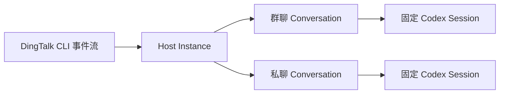

# agent-channel-host 使用指南

> 把已授权的钉钉群聊和私聊消息，持续投递到彼此隔离、可恢复的 Agent 会话。

本文面向首次安装和日常维护人员。命令示例使用 Windows PowerShell 7；当前发布包为 `@zzusp/agent-channel-host@1.0.0`，CLI 命令为 `agent-channel`。

## 这是什么

`agent-channel-host` 是运行在用户电脑上的消息宿主。它连接 DingTalk CLI（DWS）的事件流，将每个已准入群聊或私聊绑定到一个固定的 Codex session：



Host 负责接收、持久化、去重、离线补拉和可靠投递，不读取 Agent 的最终文本，也不替 Agent 判断或发送回复。Agent 是否处理、是否回复以及如何回复，仍由其工作目录中的规则和工具决定。

## 前置条件

安装前确认以下命令可用并已完成登录：

| 工具 | 最低要求 | 检查命令 | 登录命令 |
|---|---|---|---|
| Node.js | `>=22.13.0` | `node --version` | 无 |
| DingTalk CLI | 当前验证基线 `dws 1.0.55` | `dws --version` | `dws auth login` |
| Codex CLI | 当前验证基线 `codex-cli 0.145.0` | `codex --version` | `codex login` |

DWS 和 Codex 自己管理凭据。Host 的配置文件和 SQLite 数据库不会复制 token、cookie、appSecret 或 Codex 登录信息。

## 安装与升级

全局安装：

```powershell
npm install --global @zzusp/agent-channel-host
agent-channel --version
agent-channel --help
```

升级到 npm 上的最新版本：

```powershell
npm install --global @zzusp/agent-channel-host@latest
agent-channel --version
```

升级前先退出交互式 View；使用 Windows 常驻任务时，先移除旧任务，升级后再重新安装。

## 核心概念

一个 Host 的管理对象是一棵树：

```text
本机用户状态根
└── Instance（一个独立 Host 配置与数据库）
    ├── Channel（当前为 DingTalk DWS）
    ├── Runtime（当前为 Codex）
    └── Conversation
        ├── 群聊或私聊的外部身份
        ├── 准入状态、职责和 shadow/reply 模式
        ├── durable inbox 与离线补拉水位
        └── 固定 provider session 与按需 Worker
```

- **Instance**：独立的运行单元，包含配置、SQLite 状态和一组 Conversation。
- **Conversation**：一个群聊或私聊。不同 Conversation 不共享 Agent transcript。
- **Session**：Conversation 对应的长期逻辑会话；Worker 释放或 Host 重启后仍按原 ID 恢复。
- **Worker**：消息到达时按需启动的运行进程；空闲后可释放，不等于删除 Session。
- **shadow**：Agent 正常接收和处理，但该 Conversation 不具备发言权限。
- **reply**：允许 Agent 按自身规则决定是否回复；不表示每条消息都必须回复，也不表示 Host 自己发送消息。

## 命令速查

| 目标 | 命令 |
|---|---|
| 创建 Instance | `agent-channel init` |
| 检查配置、DWS 和 Codex | `agent-channel doctor` |
| 添加或管理会话 | `agent-channel conversation ...` |
| 离线验证 Codex 新建与恢复 | `agent-channel verify` |
| 查看单个 Instance JSON 状态 | `agent-channel status` |
| 打开全部 Instance 的交互管理界面 | `agent-channel view` |
| 前台运行单个 Instance | `agent-channel run` |
| 安装或移除 Windows 常驻任务 | `agent-channel service ...` |

随时使用 `agent-channel <command> --help` 查看当前版本参数，不要从旧文档猜参数。

## 从零接入一个钉钉群

### Step 1：创建 Agent 工作目录

该目录是 Codex session 的工作目录，应包含 Agent 的身份、职责、安全边界和所需 skills。不要把不可信项目与高权限 Agent 共用同一目录。

```powershell
New-Item -ItemType Directory -Path 'D:\agent-workspaces\triss' -Force
```

### Step 2：初始化 Instance

```powershell
agent-channel init `
  --instance triss `
  --cwd 'D:\agent-workspaces\triss' `
  --name '翠丝' `
  --model gpt-5.6-sol `
  --effort low
```

`init` 只创建配置和空数据库，不启动 DWS 订阅，也不发送消息。Windows 默认状态目录为：

```text
%LOCALAPPDATA%\agent-channel-host\instances\triss\
├── config.yaml
├── state.sqlite3
├── run-host.cmd
└── service.log
```

需要使用指定 DWS 组织身份时，在初始化命令中增加 `--dws-profile <corpId:userId>`。

### Step 3：执行启动前检查

```powershell
agent-channel doctor --instance triss
```

只有命令退出码为 `0`，且输出中的 DWS bus、Runtime 版本和配置都符合预期，才进入下一步。`doctor` 是只读检查，不代表 Host 已经常驻运行。

### Step 4：添加群聊

群聊标题会交给 DWS 精确搜索，必须唯一匹配：

```powershell
agent-channel conversation add `
  --instance triss `
  --kind group `
  --title '广场＆编辑器迭代中...' `
  --responsibility '回答编辑器相关问题、需求、方案和 bug 排查' `
  --mode shadow `
  --warm-seconds 30
```

首次接入建议使用 `shadow`。观察处理结果并确认 Agent 的回复边界后，再显式切换为 `reply`。

私聊不按姓名猜 ID，必须提供 DWS 返回的 `openDingTalkId`：

```powershell
agent-channel conversation add `
  --instance triss `
  --kind direct `
  --title '同事私聊' `
  --open-dingtalk-id '<openDingTalkId>' `
  --responsibility '回答职责范围内问题' `
  --mode shadow
```

查看登记结果并保存返回的 Conversation UUID：

```powershell
agent-channel conversation list --instance triss
```

### Step 5：离线验证 Session

连续执行两次，不连接 DWS、不发送钉钉消息：

```powershell
$conversationId = '<conversation UUID>'
agent-channel verify --instance triss --id $conversationId
agent-channel verify --instance triss --id $conversationId
```

第一次应为新建 Session，第二次应恢复同一 Session；两次 `providerSessionIdPrefix` 应一致。验证失败时不要启动真实订阅。

### Step 6：启动 Host

交互使用优先启动总览：

```powershell
agent-channel view
```

`view` 会发现并管理当前用户的全部 Instance。退出 View 会停止由该 View 管理的 Host；如果关闭界面后仍需常驻，请使用 Windows 用户计划任务：

```powershell
agent-channel service plan --instance triss
agent-channel service install --instance triss
agent-channel status --instance triss
```

临时前台运行单个 Instance：

```powershell
agent-channel run --instance triss
```

同一个 DWS profile 只能有一个 Channel owner。不要同时用 `view`、`run` 和计划任务抢占同一 Instance。

## 日常管理

### 查看状态

```powershell
agent-channel status --instance triss
agent-channel view --once
```

`status` 输出单个 Instance 的机器可读 JSON；`view --once` 聚合输出全部 Instance，且不会启动 Host。默认输出不展示消息正文、完整外部 ID 或完整 provider session ID；仅在本机排障时显式加 `--show-content`。

状态中的 `forwarded` 只表示消息已经交给 Runtime，不代表 Agent 已经判断、执行或回复。

### 启停和调整会话

```powershell
agent-channel conversation disable --instance triss --id $conversationId
agent-channel conversation enable  --instance triss --id $conversationId

agent-channel conversation mode `
  --instance triss `
  --id $conversationId `
  --mode reply

agent-channel conversation worker `
  --instance triss `
  --id $conversationId `
  --warm-seconds 120
```

`mode`、Worker TTL、模型或推理强度修改后，需要重启对应 Host 才生效。交互式 View 保存设置时会管理目标 Instance 的重启；前台或计划任务模式需由运维人员明确重启。

### 修改模型

```powershell
agent-channel config model `
  --instance triss `
  --model gpt-5.6-sol `
  --effort low
```

模型名称由实际 Codex Runtime 验证，Host 不做静态白名单，也不会在模型无效时静默回退。

### 移除常驻任务

先执行零副作用检查：

```powershell
agent-channel service remove --instance triss --check
agent-channel service remove --instance triss
```

移除计划任务不会删除 Instance 配置、SQLite 消息或 Session 映射。删除 Instance 或 Conversation 属于级联数据删除，只能在交互式 View 中选择明确目标并二次确认。

## 生效模型：写入配置不等于正在运行

| 操作 | 已写入本地状态 | 是否立即接收消息 | 是否需要重启 |
|---|---:|---:|---:|
| `init` | 是 | 否 | 需要启动 Host |
| `conversation add` | 是 | Host 已运行时可按新准入记录处理 | 否 |
| `conversation mode/worker` | 是 | 旧进程仍使用旧配置 | 是 |
| `config model` | 是 | 旧 Worker 不自动切换 | 是 |
| `doctor` / `verify` | 除验证 Session 外不改变运行配置 | 否 | 否 |
| `service install` | 创建用户计划任务 | 是 | 任务启动后生效 |

判断真实运行状态时，以 `status`、View、进程/计划任务和实际消息投递为证据，不以“命令返回成功”代替运行验收。

## 离线消息与可靠性

Host 启动顺序为：先建立实时订阅，再从每个已启用 Conversation 的本地最新消息时间补拉到订阅 ready 时刻。没有本地消息时，从 Conversation 创建时间开始。补拉期间 Worker 不启动；任何会话补拉失败都会 fail closed，不伪装 ready。

历史与实时消息有 2 秒重叠窗口，并按消息 ID 或 fingerprint 去重。SQLite durable inbox 是唯一水位事实源，不另外维护一份容易不一致的 cursor。DWS 事件总线本身是易失 fan-out，因此可靠性依赖“实时订阅 + 启动补拉 + 本地持久化”，不能宣称端到端 exactly-once。

## 常见问题

### `doctor` 报 DWS bus stale 或 RPC 不可用

先执行：

```powershell
dws event status
dws --version
```

只有 PID 存活不代表事件总线可用。重新登录或恢复 DWS 后再次执行 `doctor`，不要绕过检查直接启动 Host。

### 添加群聊时报标题不唯一或找不到

使用钉钉中的完整群名，并确认当前 DWS profile 能看到该群。Host 要求唯一精确匹配，不会在多个候选中猜测。

### 私聊无法添加

`--open-dingtalk-id` 不是姓名、手机号或 Host 内部 UUID。应使用 DWS 返回的对端稳定 ID。

### 修改配置后行为没有变化

先确认命令输出中的 `restartRequired`，再重启对应的前台进程或用户计划任务。使用 View 修改时，观察目标 Instance 的重启结果和告警。

### 消息显示 `failed`

`failed` 表示 Runtime 没有返回 `turn.completed` 或进程异常退出。Host 会保留可恢复消息并在重启 reconciliation 后重试；达到失败上限的消息不会无限循环。结合 `status`、View 告警与 `service.log` 定位根因。

### Node.js 显示 SQLite experimental warning

当前 Node 22 的内置 `node:sqlite` 可能输出 experimental warning；只要 Node 版本满足要求且命令退出码为 `0`，该警告本身不代表 Host 失败。

## 最佳实践

1. 首次接入使用 `shadow`，完成真实消息观察后再按 Conversation 开启 `reply`。
2. 一个 Agent 身份使用专门的 Runtime 工作目录，将长期权限和安全规则放在该目录，而不是只依赖短职责文本。
3. `doctor → conversation add → verify 两次 → view/run` 按顺序执行，不跳过离线 Session 验证。
4. 自动化和管道只使用 `status` 或 `view --once`，不要启动交互式 View。
5. 先 `service remove --check` 再删除计划任务；删除 Conversation 或 Instance 前确认级联范围。
6. 不把 `forwarded`、CI 成功或命令成功回执当作“Agent 已回复”或“业务已完成”。

## 参考资料

本文的信息组织参考钉钉 CLI 文档的“概念—命令速查—从零实战—生效模型—最佳实践”路径，产品行为以 agent-channel-host 当前源码和 CLI 帮助为准：

- [DingTalk CLI — 让 AI 真正帮你在钉钉里干活](https://open.dingtalk.com/document/development/dingtalk-cli-performing-tasks-within)
- [钉钉 CLI 事件订阅 — 给你的 Agent 装上钉钉的“耳朵”](https://open.dingtalk.com/document/development/dingtalk-cli-event-subscription)
- [开发者命令行 · CLI 应用管理指南](https://open.dingtalk.com/document/development/dev-cli-app-management-guide)
- [agent-channel-host npm package](https://www.npmjs.com/package/@zzusp/agent-channel-host)
